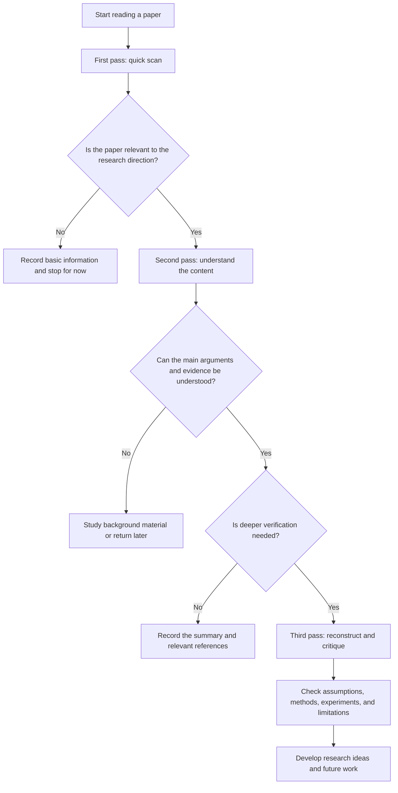
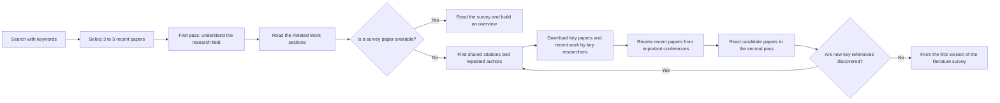

# How to Read a Paper: Study Notes

## Table of Contents

- [1. Basic Information](#1-basic-information)
- [2. Motivation for Reading This Paper](#2-motivation-for-reading-this-paper)
- [3. The Core Concept: The Three-Pass Approach](#3-the-core-concept-the-three-pass-approach)
    - [First Pass: Build a Bird's-Eye View](#1-first-pass-build-a-birds-eye-view)
    - [Second Pass: Understand the Content and Evidence](#2-second-pass-understand-the-content-and-evidence)
    - [Third Pass: Reconstruct, Verify, and Critique](#3-third-pass-reconstruct-verify-and-critique)
- [4. Comparison of the Three Passes](#4-comparison-of-the-three-passes)
- [5. Using the Three-Pass Approach for a Literature Survey](#5-using-the-three-pass-approach-for-a-literature-survey)
- [6. My Reflection](#6-my-reflection)
- [7. Practical Methods I Learned from This Paper](#7-practical-methods-i-learned-from-this-paper)
- [8. Conclusion](#8-conclusion)
- [9. Reference](#9-reference)

## 1. Basic Information

| Item | Description |
| --- | --- |
| Paper title | How to Read a Paper |
| Author | S. Keshav |
| Affiliation | David R. Cheriton School of Computer Science, University of Waterloo |
| Topic | How to read research papers efficiently and conduct a literature survey |
| Core method | The Three-Pass Approach |
| Target readers | Beginning researchers, graduate students, paper reviewers, and anyone conducting a literature review |

## 2. Motivation for Reading This Paper

Researchers usually spend a great deal of time reading papers, but how to read a paper efficiently is rarely taught formally. When first entering a research field, it is easy to read a paper line by line from the first page. After encountering unfamiliar terms, formulas, or experimental details, however, the reader may become stuck and spend a great deal of time without knowing whether the paper is actually relevant to the research direction.

This paper introduces the Three-Pass Approach. Instead of trying to understand every detail at the beginning, readers should divide the process into three levels according to their reading goals and gradually increase their depth of understanding. This method helps readers quickly evaluate a paper before deciding whether it deserves more time.

## 3. The Core Concept: The Three-Pass Approach

### 1. First Pass: Build a Bird's-Eye View

The goal of the first pass is not to understand every detail, but to grasp the overall direction of the paper in about five to ten minutes. The author recommends reading the following:

1. The title, abstract, and introduction.
2. The section and subsection headings while ignoring the main text for now.
3. The conclusion.
4. The references, paying attention to papers that have already been read or recognized.

After the first pass, the following five Cs can be used to decide whether the paper deserves further reading:

| Five Cs | Question to answer | What to look for |
| --- | --- | --- |
| Category | What type of paper is this? | A measurement paper, an analysis, a system description, or a research prototype? |
| Context | Which research is it related to? | Which theories, methods, or previous studies does it use? |
| Correctness | Do its assumptions appear reasonable? | Are there obvious concerns about the research question, data, or method? |
| Contributions | What are its main contributions? | What problem did the authors actually solve? |
| Clarity | Is the paper clear? | Are its structure, figures, and explanations easy to understand? |

### 2. Second Pass: Understand the Content and Evidence

The second pass should be more careful than the first, while complex proofs and low-level implementation details can still be ignored initially. Readers should record key points and pay particular attention to figures, diagrams, and experimental results.

| Item to check | Question to ask |
| --- | --- |
| Figure axes | Are the X-axis and Y-axis clearly labeled? Are the units correct? |
| Experimental results | Are error bars or other statistical information provided to support the conclusions? |
| Methodology | Are the experimental steps sufficient for reproduction? |
| References | Are there important papers that should be read later? |
| Claims and evidence | Are the authors' conclusions actually supported by the results? |

After the second pass, readers should be able to explain the paper's main argument to someone else and provide the evidence supporting it. If the paper is still difficult to understand, the reason may be insufficient background knowledge, unfamiliar terminology, unclear writing, or an unsuitable reading time. In that situation, readers can study the background material and return to the paper later instead of forcing themselves to finish it in one sitting.

### 3. Third Pass: Reconstruct, Verify, and Critique

The goal of the third pass is to reconstruct the authors' research process mentally or through implementation. Readers should use the same assumptions as the authors, consider whether similar results could be obtained, and examine the conditions behind each step.

| Analysis direction | Questions to consider |
| --- | --- |
| Assumptions | Did the authors omit any important conditions? Do the assumptions hold in real-world situations? |
| Method | Would I use the same method? Are there alternative approaches? |
| Experiment | Is the experimental setup fair? Are the sample size, baselines, and evaluation metrics sufficient? |
| Results | Do the results support the authors' claims? Are there other possible explanations? |
| Novelty | Where is the actual new contribution? Which parts combine existing methods? |
| Limitations | Under what conditions might the method fail? Did the authors explain these limitations honestly? |
| Future work | What research questions can be developed from the paper's weaknesses? |

## 4. Comparison of the Three Passes

| Reading stage | Main purpose | Suggested time | Reading focus | Expected outcome |
| --- | --- | --- | --- | --- |
| First pass | Decide whether the paper deserves deeper reading | 5 to 10 minutes | Title, abstract, introduction, section headings, conclusion, and references | Paper category, research context, main contributions, and initial questions |
| Second pass | Understand the main content of the paper | Up to about 1 hour | Main paragraphs, figures, methods, and experimental results | An explanation of the paper's main idea and supporting evidence |
| Third pass | Verify and critique the paper in depth | 4 to 5 hours for beginners, about 1 hour for experienced readers | All details, assumptions, proofs, experiments, and limitations | A reconstructed research process, strengths, weaknesses, and future directions |

## 5. Using the Three-Pass Approach for a Literature Survey

The author also explains that the Three-Pass Approach is useful not only for reading a single paper, but also for building a map of a research field.

| Literature survey step | How to do it | Purpose |
| --- | --- | --- |
| 1. Initial search | Use Google Scholar or another academic search engine to find 3 to 5 recent papers with research-related keywords | Quickly understand the field and its common problems |
| 2. Read related work | Examine the Related Work sections and references of candidate papers | Identify the research context and important previous work |
| 3. Find shared patterns | Track repeatedly cited papers and recurring authors | Focus on influential research results |
| 4. Follow researchers | Visit the websites and recent publications of key authors | Find current research and important research communities |
| 5. Check conferences | Browse recent proceedings from important conferences in the field | Find high-quality related work that search results may have missed |
| 6. Iterate | Add an unread paper when multiple papers cite it as important | Gradually build a complete and focused collection of literature |

## 6. My Reflection

This paper is suitable for researchers at different stages. For beginners, especially someone like me who is re-entering a new research field, it is often difficult to know how to find the papers most relevant to a research topic from the vast sea of academic literature. The Three-Pass Approach provides a practical reading order. Instead of trying to read every formula and experimental detail at the beginning, I can first use the first pass to decide whether a paper deserves more time.

I think the first pass is the most efficient way to search for and screen papers. By reading the title, abstract, introduction, section structure, conclusion, and references, I can first build an overall impression of the paper. After finding a paper related to my research direction, I can continue searching through its references, frequently cited paper titles, and recurring authors. In this way, the collected papers are not merely papers that match a keyword. They gradually form a collection with a clearer research context and stronger relevance.

The author points out that during the second pass, readers should carefully examine the figures, methods, and experimental results instead of directly accepting the authors' conclusions. I think it is very important to maintain a questioning attitude while reading. In today's AI era, when information can be collected easily, AI can help us search for papers, organize summaries, translate text, and explain unfamiliar concepts, making the first and second passes more efficient. However, AI-generated organization should only be a starting point for reading; it cannot replace returning to the original paper to check the evidence. Readers still need to confirm whether the research question, method, and results correspond to one another, and consider whether the authors' assumptions are reasonable. This reflects the reading method described by the author: first understand the overall picture, then build our own judgment through the figures, methods, and experiments instead of completely accepting conclusions provided by a tool or by the authors.

The third pass helped me understand that in-depth reading is not simply reading the paper more carefully. It also means trying to reconstruct the authors' research process. I can ask myself: If I designed this experiment, would I make the same choices? If the dataset, evaluation metrics, or baselines were changed, would the conclusions still hold? These questions help me move from understanding what the authors said to judging why they made certain choices and whether those choices were reasonable enough.

For my current research, this method can also be applied to reading papers related to data-center monitoring, CPU utilization, power consumption, and temperature prediction. In the first pass, I can screen papers with similar research questions and data sources. In the second pass, I can compare the features, models, and evaluation methods used in different papers. In the third pass, I can carefully examine whether the experimental conditions, data splits, and results are reproducible. In this way, reading papers becomes more than collecting information; it gradually builds my understanding and judgment of the research field.

## 7. Practical Methods I Learned from This Paper

| Common problem | Approach after applying the Three-Pass Method |
| --- | --- |
| Reading every paper from the first line to the last | Use the first pass to quickly judge relevance and value |
| Spending too much time on irrelevant papers | Use the five Cs for early screening |
| Looking only at the authors' conclusions without checking the evidence | Examine figures, methods, and experimental design during the second pass |
| Getting completely stuck when encountering unfamiliar details | Understand the overall content first, then study the background |
| Remembering only scattered information after reading | Write down the main idea, contributions, limitations, and questions in my own words |
| Not knowing how to find more relevant papers | Extend the search through shared citations, recurring authors, and important conferences |

## 8. Conclusion

The most important contribution of “How to Read a Paper” is that it organizes paper reading, which may seem to require a great deal of time and experience, into a method that can be practiced and reused. The Three-Pass Approach does not require every paper to be read three times. Instead, it allows readers to adjust the depth of reading according to their research goals and available time.

My greatest takeaway is that efficient reading does not mean careless reading. It means allocating time at the appropriate level. The first pass builds an overview, the second pass develops an understanding of the content and checks the evidence, and the third pass reconstructs the research and develops a critique. In the future, when reading papers or using AI to assist my research, I will keep this process in mind: screen first, understand next, and verify last. This will help me avoid losing my research focus when faced with too much information.

## 9. Reference

- Keshav, S., “How to Read a Paper.”
