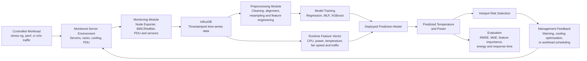

# Project Planning: CortexDC Thermal Prediction and Energy-Aware Management

## Reference

- **Reference Paper:** Shashikant Ilager, Kotagiri Ramamohanarao, and Rajkumar Buyya, “Thermal Prediction for Efficient Energy Management of Clouds Using Machine Learning,” *IEEE Transactions on Parallel and Distributed Systems*, vol. 32, no. 5, pp. 1044–1056, May 2021.
- **DOI:** [10.1109/TPDS.2020.3040800](https://doi.org/10.1109/TPDS.2020.3040800)

---

# Basic Information

| Item | Information |
|---|---|
| Project Title | Machine Learning-Based Thermal and Power Prediction for CortexDC |
| Student ID / Name | M11502273 / Chynna |
| Git Repository / Project Link | [MWN-2026-M11502273-Chynna](https://github.com/yihsunnnn/MWN-2026-M11502273-Chynna) |
| Planning Approval Date | YYYY-MM-DD |

---

# Part A. Detailed Project Planning

## A1. Project Summary

- **Problem to be solved:** In cloud data centers, heat generated by server operation increases the burden on cooling systems. Excessive server temperature can create hotspots, increase cooling costs, and reduce equipment reliability. Temperature variation is affected not only by CPU load and power consumption, but also by physical server location, inlet temperature, fan speed, heat recirculation, and thermal throttling, making accurate prediction difficult with a single fixed theoretical model. Existing sensors show the current thermal state, but resource provisioning, workload scheduling, and cooling configuration require knowledge of future temperature changes. This project will use monitoring data collected by the CortexDC platform to develop a method for predicting server temperature and power and apply the predictions to energy-aware resource management.

- **Key challenges:** Thermal behavior has a non-linear relationship with workload, power, CPU temperature, inlet temperature, fan speed, and traffic. Different physical servers may also behave differently, while monitoring data may be missing or noisy. In addition, application-level information may not be available in a shared infrastructure.

- **Proposed method:** Collect host-level metrics through Node Exporter and other monitoring interfaces, store them in InfluxDB, and combine CPU usage, traffic, power, temperature, and fan measurements. Compare regression and machine learning models, using XGBoost as the primary model based on the reference paper. Use the prediction results to identify hotspot risk and support later cooling or scheduling decisions.

- **Expected outcomes:** Produce a reproducible CortexDC dataset, an evaluated temperature and power prediction model, a feature-importance analysis, and a prototype monitoring workflow. The project is expected to provide accurate predictions and a foundation for more efficient data-center management.

## A2. System Architecture

### Current Preliminary Architecture

The following diagram shows the current preliminary integration architecture of the CortexDC monitoring platform and AIMLFW. It includes the SMO, SMO InfluxDB, AIMLFW/Kubeflow, O2 services, CortexDC, monitored O-Cloud machines, iPerf traffic, temperature sensors, cooling systems, and PDU data sources. The diagram describes the current system components and connections. The temperature and power prediction model proposed in this project will be built on top of these monitoring and AI/ML training workflows.

### Architecture Component Description

- **SMO:** Acts as the upper-level management environment. It provides InfluxDB, RAN NF OAM, and rAPP services. The SMO receives monitoring data and can issue model-training or testing requests through rAPPs.
- **SMO InfluxDB:** Stores time-series data received from CortexDC and other monitoring workflows for later querying, data analysis, and AI/ML model training.
- **AIMLFW/Kubeflow:** Executes the AI/ML training workflow. The Training rAPP sends a training request to the AIMLFW Training Manager through a REST API. Kubeflow then creates and runs the training pipeline, producing a model for later testing or prediction.
- **O-Cloud and O2 services:** O-Cloud is the cloud environment hosting the CN, O-CU, O-DU, O-RU, and AIMLFW components. O2 services provide management and resource connectivity between the SMO and O-Cloud so that SMO services can interact with O-Cloud components.
- **CortexDC:** Is a platform for monitoring server conditions, not a server itself. It obtains CPU, temperature, power, fan, and other hardware-status data from monitored servers through Redfish APIs or other monitoring interfaces, then provides the data to databases and later analysis workflows.
- **Monitored O-Cloud machines:** The diagram includes the CN (open5GS) iPerf Server, O-CU, O-DU, and O-RU. These components are the monitored objects that generate workload, traffic, and hardware-status data.
- **Temperature sensors, cooling systems, and PDU:** These are important data sources for thermal and energy monitoring. Temperature sensors provide server or environmental temperature, the cooling system represents the thermal condition, and the PDU provides power-related measurements.
- **COTS UE / iPerf Client:** Acts as the traffic source. It sends iPerf traffic through the O-RU, O-DU, O-CU, and CN test path to create different network-load conditions.
- **Control PC:** Connects to test devices through SSH/SFTP and ADB. It starts tests, configures iPerf conditions, and executes automated operations.
- **Training rAPP and Test Automation rAPP:** The Training rAPP triggers model training, while the Test Automation rAPP executes test procedures and changes experimental conditions. Both communicate with related services through REST APIs.

### Architecture Data Flow

1. **Generate test traffic:** The Control PC configures the COTS UE or iPerf Client to generate different iPerf traffic rates. The traffic passes through the O-RU, O-DU, and O-CU before reaching the CN (open5GS) iPerf Server.
2. **Collect server monitoring data:** CortexDC obtains CPU utilization, CPU temperature, power, fan speed, and other hardware-status data from monitored servers through Redfish APIs and Node Exporter.
3. **Store monitoring data:** CortexDC first writes the collected data to a database. It is then connected to SMO InfluxDB through the O2IMS connection method and becomes queryable time-series data. It can be aligned by timestamp with additional CPU-usage and PDU measurements.
4. **Train the model:** The Training rAPP sends training parameters to the AIMLFW Training Manager through a REST API. AIMLFW/Kubeflow retrieves the source data, performs data processing and model training, and produces the trained model.
5. **Run tests and predictions:** The Test Automation rAPP changes traffic or workload conditions. The system continuously collects new monitoring data and uses the trained model to analyze the effects of different traffic levels on CPU utilization, temperature, and power.
6. **Support future management:** Prediction results can support hotspot warnings, cooling-setting adjustments, or workload scheduling. The current project first focuses on data collection, model training, and prediction validation; actual control actions are future work.

### Relationship to This Project

The architecture can be divided into three parts:

- **Data source layer:** Monitored O-Cloud machines, CortexDC, Redfish APIs, temperature sensors, PDU, and iPerf workloads.
- **Data and training layer:** SMO InfluxDB, Training rAPP, AIMLFW Training Manager, and Kubeflow.
- **Testing and application layer:** Test Automation rAPP, Control PC, hotspot-risk analysis, and future cooling optimization or workload management.

Therefore, this project does not build a new server platform. It uses the existing monitoring capability of CortexDC, sends monitored-server data into SMO/AIMLFW for model training, and builds a temperature and power prediction workflow.

### System Assumptions

- The CortexDC platform can obtain CPU utilization, memory, network, temperature, fan, and power-related metrics from monitored servers through Redfish APIs and Node Exporter.
- InfluxDB is available as the time-series database for storing and querying monitoring data.
- The input traffic or workload can be controlled through `stress-ng`, iperf, or an existing end-to-end test workflow.
- Measurements can be aligned by timestamp and resampled to a common interval.
- The first stage predicts server-level temperature and power; scheduling or cooling control is a later application of the prediction results.
- The model is initially trained for the server environment monitored by the CortexDC platform because server hardware, rack position, airflow, and cooling conditions may differ across data centers.
- The experimental workload must include multiple load levels so that the training data covers both normal and high-load conditions.

### Environment

- **CortexDC monitoring platform and monitored environment:** The CortexDC platform, together with the physical servers, CPUs, memory, network interfaces, fans, temperature sensors, power meters, and rack-level equipment that it monitors.
- **Monitoring layer:** Node Exporter, Redfish interfaces, and PDU measurements.
- **Data platform:** InfluxDB stores time-series measurements; preprocessing scripts clean, align, and aggregate the data.
- **Experiment controller:** O2IMS or the selected test workflow configures the experiment and PM Mapping when applicable.
- **Workload generator:** `stress-ng` produces controlled CPU load, while iperf or an e2e workflow produces different traffic conditions.
- **Analysis and prediction layer:** Python-based preprocessing, model training, evaluation, and visualization tools.
- **Management layer:** The prediction output can later be used by a thermal warning, cooling optimization, or workload scheduling module.

### Input Parameters

- **`CPU_usage`:** CPU utilization of the server
- **`Network_in` / `Network_out`:** Inbound and outbound traffic
- **`Power`:** Server or rack power consumption
- **`CPU_temperature`:** CPU temperature measurement
- **`Fan_speed`:** Fan speed or fan percentage
- **`Workload_type`:** `stress-ng` or iperf test condition
- **`Traffic_rate`:** Input traffic level used in the experiment
- **`Timestamp`:** Time used to align all measurements
- **`Server_ID` / `Rack_ID`:** Physical identity and location of the monitored device

### Output Parameters

- **`Predicted_temperature`:** Temperature predicted for the next time interval
- **`Predicted_power`:** Estimated future server or rack power consumption
- **`Temperature_change`:** Expected temperature increase or decrease
- **`Hotspot_risk`:** Risk level indicating whether a thermal threshold may be reached
- **`Feature_importance`:** Contribution of CPU usage, power, traffic, and other features
- **`Prediction_error`:** RMSE, MAE, and other model evaluation results
- **`Recommended_action`:** Warning, workload adjustment, cooling adjustment, or workload scheduling

### Proposed Control and Analysis Modules

1. **Experiment and Workload Module:** Controls the number of monitored servers, CPU load, and traffic conditions so that experiments are repeatable.
2. **Monitoring Module:** Uses Node Exporter, BMC/Redfish, PDU, and related interfaces to collect server and rack metrics.
3. **Data Storage Module:** Writes timestamped measurements to InfluxDB and maintains consistent field names and units.
4. **Data Preprocessing Module:** Removes invalid data, handles missing values, aligns timestamps, resamples measurements, and creates training features.
5. **Prediction Module:** Compares regression models and XGBoost to predict future temperature and power.
6. **Risk Detection Module:** Compares predicted values with thermal and power thresholds to identify hotspot risk.
7. **Management Feedback Module:** Provides warnings and prediction results for later cooling optimization or workload scheduling.

The environment generates CPU, traffic, power, and thermal changes under controlled workloads. The monitoring layer collects these measurements and stores them in InfluxDB. After preprocessing, the data is used to train a prediction model. During runtime, the model receives current features and predicts the next temperature and power state. The risk-detection module compares the prediction with predefined thresholds and passes the result to management actions or future scheduling and cooling modules.

---

## A3. Expected Deliverables and Validation

### Expected Deliverables

- A documented CortexDC monitoring dataset with synchronized CPU, traffic, power, and temperature fields.
- A Node Exporter and InfluxDB data-collection workflow.
- A repeatable experiment script for CPU-load and traffic conditions.
- A preprocessing pipeline for cleaning, timestamp alignment, and feature engineering.
- Baseline regression and XGBoost prediction models.
- Temperature and power prediction results with RMSE and MAE evaluation.
- Feature-importance analysis showing which metrics most affect thermal behavior.
- A hotspot-risk detection prototype and visualization dashboard or report.
- Recommendations for future cooling optimization or thermal-aware workload scheduling.

### Validation Method

- **Experimental environment:** The CortexDC monitoring platform connected to Node Exporter, BMC/Redfish, PDU, and InfluxDB monitoring services for the monitored servers.
- **Workload conditions:** Several controlled CPU-load levels and traffic rates generated by `stress-ng` or iperf.
- **Data fields:** CPU usage, server power, CPU temperature, fan speed, server identity, and timestamp.
- **Sampling policy:** Select and document a common collection interval, then align all data sources to that interval.
- **Data split:** Divide data chronologically into training, validation, and testing sets to avoid using future information during training.
- **Prediction targets:** Temperature and power at the next selected time interval.
- **Evaluation metrics:** RMSE, MAE, maximum error, inference time, and hotspot-risk detection accuracy.
- **Baselines:** Historical-value baseline, linear regression, and the best available existing prediction method.
- **Reproducibility:** Record workload settings, server conditions, collection interval, model parameters, and experiment time range.

### Experiment Scenario 1: Monitoring and Data Quality Evaluation

- **Design:** Install and configure the monitoring tools and collect data under stable and controlled conditions.
- **Checks:** Verify timestamps, missing values, units, sensor ranges, collection intervals, and consistency among server measurements.
- **Purpose:** Ensure that the dataset is reliable before model training.
- **Expected result:** A synchronized dataset with documented data quality and sufficient samples for each workload and traffic level.

### Experiment Scenario 2: Temperature and Power Prediction

- **Design:** Train linear regression and XGBoost using the collected physical features.
- **Comparison:** Evaluate models under different workload and traffic levels and compare RMSE, MAE, maximum error, and inference time.
- **Purpose:** Determine whether machine learning can predict the future temperature and power of servers monitored by CortexDC more accurately than simple baselines.
- **Expected result:** The selected model reduces prediction error and can generate results quickly enough for monitoring or management decisions.

### Experiment Scenario 3: Feature and Traffic-Impact Analysis

- **Design:** Use feature importance and controlled traffic experiments to measure how CPU usage, power, traffic rate, and fan speed affect the prediction target.
- **Visualization:** Plot traffic rate on the X-axis and each measured Feature on the Y-axis, then compare trends across servers and experiments.
- **Purpose:** Identify the most influential features and determine whether different input traffic levels produce measurable thermal or power changes.
- **Expected result:** Power, CPU utilization, temperature, and selected traffic-related features show meaningful relationships with the prediction target.

### Experiment Scenario 4: Hotspot-Risk Detection

- **Design:** Compare predicted temperature with a predefined safety threshold and classify each future interval as normal, warning, or hotspot risk.
- **Purpose:** Verify whether the model can accurately predict the server temperature in the next time interval and correctly determine whether the predicted temperature will exceed the defined thermal safety threshold.
- **Metrics:** Use RMSE, MAE, and maximum error for continuous temperature prediction; use Accuracy, Precision, Recall, F1-score, false-positive rate, and false-negative rate for hotspot-risk classification.
- **Expected result:** The difference between predicted and actual temperature remains within an acceptable range, and the model can effectively distinguish normal temperature states from states that exceed the thermal safety threshold.

---

## A4. Cross-Validation

Answer the following two questions:

1. **Can the proposed contributions address the identified challenges?**
2. **Do the planned experiments provide sufficient evidence that the proposed method solves the problem?**

| Validation Question | Analysis | Conclusion |
|---|---|---|
| **Can the proposed contributions address the identified challenges?** | **Challenge 1 - Complex thermal behavior:** Combining CPU usage, power, temperature, fan speed, inlet temperature, and traffic features allows the model to learn relationships that are difficult to represent with one fixed equation. **Challenge 2 - Data integration:** Node Exporter, BMC/Redfish, PDU, and InfluxDB provide a practical monitoring chain for collecting and aligning data. **Challenge 3 - Hotspot classification:** Comparing the predicted temperature for the next interval with a safety threshold allows the system to classify normal states and potential threshold-exceeding states. **Challenge 4 - Unknown feature influence:** Feature-importance analysis and controlled traffic experiments can identify which metrics contribute most to temperature and power changes. | ✓ The proposed system addresses the identified challenges at the monitoring and prediction level. |
| **Do the planned experiments provide sufficient evidence that the proposed method solves the problem?** | **Scenario 1** validates data quality and collection reliability. **Scenario 2** evaluates temperature and power prediction accuracy against baseline models. **Scenario 3** tests the relationship between traffic and thermal or power Features. **Scenario 4** compares predicted and actual temperatures and verifies whether the model correctly classifies normal states and states exceeding the thermal safety threshold. **Limitations:** The first version may use data from only a limited number of servers and a controlled workload. Prediction accuracy may decrease when the workload, hardware, rack location, or cooling condition changes. A later phase is needed to validate actual cooling or scheduling actions in production. | ⚠ The evidence will be sufficient for a prototype prediction and hotspot-classification system, but broader validation is required before claiming production-level energy savings. |

### Main Risks and Mitigation

| Risk | Mitigation |
|---|---|
| Missing or inconsistent monitoring data | Check timestamps and units, remove invalid records, and document missing-data handling. |
| Insufficient workload diversity | Use multiple CPU-load and traffic levels and repeat each condition. |
| Model overfitting to one server | Use chronological testing, server-based validation, and evaluate across multiple hosts when possible. |
| False hotspot predictions | Define thresholds from measured data and report false-positive and false-negative rates. |
| Prediction does not lead to energy savings | Treat energy optimization as a later control stage and first validate temperature prediction error and hotspot-classification accuracy. |

---

## Overall Proposal Logic

**Thermal and energy problem → Controlled workload experiments → Monitoring and InfluxDB data collection → Feature engineering → Temperature and power prediction → Hotspot-risk detection → Future cooling or scheduling optimization**

This proposal uses the reference paper's data-driven thermal prediction concept but applies it to the CortexDC monitoring platform and its monitored server environment. The primary research contribution is to build and validate a practical monitoring and prediction workflow using accessible server-level features. The project will not claim that energy is reduced until a later experiment connects prediction results to a real cooling or workload-management action.

## Reference

Ilager, S., Ramamohanarao, K., and Buyya, R., “Thermal Prediction for Efficient Energy Management of Clouds Using Machine Learning,” *IEEE Transactions on Parallel and Distributed Systems*, vol. 32, no. 5, pp. 1044–1056, 2021. DOI: [10.1109/TPDS.2020.3040800](https://doi.org/10.1109/TPDS.2020.3040800)
