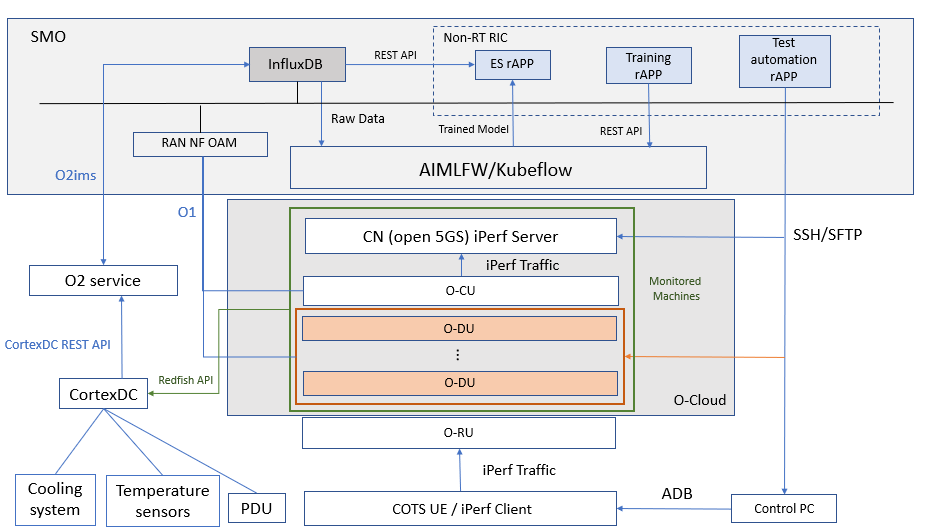
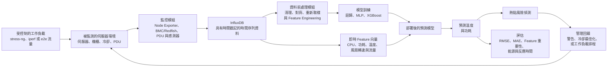

# 專題規劃：CortexDC 熱預測與節能管理

## 參考論文

- **參考論文：** Shashikant Ilager、Kotagiri Ramamohanarao 與 Rajkumar Buyya，〈Thermal Prediction for Efficient Energy Management of Clouds Using Machine Learning〉，*IEEE Transactions on Parallel and Distributed Systems*，第 32 卷第 5 期，1044–1056 頁，2021 年 5 月。
- **DOI：** [10.1109/TPDS.2020.3040800](https://doi.org/10.1109/TPDS.2020.3040800)

---

# 基本資料

| 項目 | 資訊 |
|---|---|
| 專題名稱 | 基於機器學習的 CortexDC 溫度與功耗預測 |
| 學號／姓名 | M11502273 / Chynna |
| Git Repository／專題連結 | [MWN-2026-M11502273-Chynna](https://github.com/yihsunnnn/MWN-2026-M11502273-Chynna) |
| 計畫核准日期 | YYYY-MM-DD |

---

# Part A. 詳細專題規劃

## A1. 專題摘要

- **要解決的問題：** 在雲端資料中心中，伺服器運作產生的熱能會提高冷卻系統的負擔；當伺服器溫度過高時，可能形成熱點、增加冷卻成本，並影響設備的可靠性。溫度變化不只受到 CPU 負載與功耗影響，也會受到伺服器實體位置、進氣溫度、風扇轉速、熱回流與系統熱節流等因素影響，因此難以透過單一固定的理論模型準確預測。現有感測器只能提供目前的溫度狀態，但資源配置、工作負載排程與冷卻設定需要預先知道未來的溫度變化。本專題希望利用 CortexDC 蒐集的監控資料，建立伺服器溫度與功耗預測方法，並將預測結果應用於能源感知的資源管理。

- **主要挑戰：** 熱行為與工作負載、功耗、CPU 溫度、進氣溫度、風扇轉速及流量之間具有非線性關係。不同實體伺服器的熱行為也可能不同，監控資料可能存在遺漏值或雜訊；此外，在共享基礎設施中通常無法取得應用程式層級的完整資訊。

- **提出的方法：** 透過 Node Exporter 與其他監控介面蒐集主機層級指標，並將資料儲存於 InfluxDB，整合 CPU 使用率、流量、功耗、溫度與風扇資訊。比較迴歸模型與機器學習模型，並以參考論文中的 XGBoost 作為主要模型。利用預測結果辨識熱點風險，並支援後續冷卻或工作負載排程決策。

- **預期成果：** 建立可重現的 CortexDC 資料集、完成溫度與功耗預測模型評估、分析各 Feature 的重要性，並製作一套初步監控與預測流程。專題預期能提供準確的預測結果，並作為提升資料中心管理效率的基礎。

## A2. 系統架構

### 目前的初步架構

下圖為目前 CortexDC 監控平台與 AIMLFW 的初步整合架構。圖中包含 SMO、SMO 內的 InfluxDB、AIMLFW/Kubeflow、O2 services、CortexDC、受監控的 O-Cloud、iPerf 流量、溫度感測器、冷卻系統與 PDU 資料來源。這張圖描述的是目前系統的實際元件與連線方式；後續的溫度與功耗預測模型，會建立在這些監控資料與 AI/ML 訓練流程之上。

### 架構圖元件說明

- **SMO：** 作為上層管理環境，負責提供 InfluxDB、RAN NF OAM 與各種 rAPP。SMO 會接收監控資料，也可以透過 rAPP 發出模型訓練或測試請求。
- **SMO InfluxDB：** 儲存由 CortexDC 或其他監控流程傳入的時間序列資料，供後續查詢、資料分析與 AI/ML 模型訓練使用。
- **AIMLFW/Kubeflow：** 負責執行 AI/ML 模型訓練流程。Training rAPP 透過 REST API 將訓練請求送至 AIMLFW Training Manager，再由 Kubeflow 建立並執行訓練 Pipeline；訓練完成後產生模型，供後續測試或預測使用。
- **O-Cloud 與 O2 services：** O-Cloud 是承載 CN、O-CU、O-DU、O-RU 與 AIMLFW 元件的雲端環境。O2 services 提供 SMO 與 O-Cloud 之間的管理與資源連接，讓 SMO 可以與 O-Cloud 中的服務互動。
- **CortexDC：** 是監測伺服器狀況的平台，它透過 Redfish API 、Node Exporters取得被監測伺服器的 CPU、溫度、功耗、風扇與其他硬體狀態，並將資料提供給資料庫與後續分析流程。
- **被監測的 O-Cloud machines：** 圖中包含 CN（open5GS）iPerf Server、O-CU、O-DU 與 O-RU 等元件。這些設備是實際產生工作負載、流量與硬體狀態資料的被監測對象。
- **溫度感測器、冷卻系統與 PDU：** 這些是 CortexDC 蒐集熱與能源資料的重要來源。溫度感測器提供伺服器或環境溫度，冷卻系統代表散熱條件，PDU 則提供電力與功耗相關資料。
- **COTS UE / iPerf Client：** 作為流量來源，透過 iPerf 將流量送往 O-RU、O-DU、O-CU 與 CN 的測試鏈路，用來建立不同的網路負載條件。
- **Control PC：** 透過 SSH/SFTP 與 ADB 連接測試設備，負責啟動測試、設定 iPerf 條件與執行自動化操作。
- **Training rAPP 與 Test automation rAPP：** Training rAPP 負責觸發模型訓練；Test automation rAPP 負責執行測試流程並改變實驗條件。

### 架構圖資料流

1. **產生測試流量：** Control PC 設定 COTS UE 或 iPerf Client，產生不同大小的 iPerf traffic，經過 O-RU、O-DU、O-CU，最後到達 CN（open5GS）iPerf Server。
2. **取得伺服器監控資料：** CortexDC 透過 Redfish API、Node Exporters，從被監測的伺服器取得 CPU 使用率、CPU 溫度、功耗、風扇與其他硬體狀態。
3. **儲存監控資料：** CortexDC 取得的資料先寫入資料庫，再透過O2ims的連接方式連至SMO InfluxDB，形成可查詢的時間序列資料。這些資料可以與額外蒐集的 CPU usage及 PDU 資料依照 timestamp 對齊。
4. **進行模型訓練：** Training rAPP 將訓練參數透過 REST API 傳給 AIMLFW Training Manager。AIMLFW/Kubeflow 從資料庫取得原始資料，執行資料處理與模型訓練，最後產生訓練模型。
5. **執行測試與預測：** Test automation rAPP 改變流量或工作負載條件，系統持續收集新的監控資料，再使用訓練好的模型分析不同流量對 CPU、溫度與功耗的影響。
6. **支援後續管理：** 預測結果可提供熱點警示、冷卻設定調整或工作負載排程使用；本研究目前先完成資料蒐集、模型訓練與預測驗證，實際控制動作列為後續工作。

### 與本研究的關係

這張架構圖可以分成三個部分：

- **資料來源層：** 被監測的 O-Cloud server、CortexDC、Redfish API、溫度感測器、PDU 與 iPerf 工作負載。
- **資料與訓練層：** SMO InfluxDB、Training rAPP、AIMLFW Training Manager 與 Kubeflow。
- **測試與應用層：** Test automation rAPP、Control PC、熱點風險分析，以及後續的冷卻最佳化或工作負載管理。

因此，本研究不是重新建立一個伺服器平台，而是利用 CortexDC 已有的監控能力，將被監測伺服器的資料送入 SMO/AIMLFW 進行模型訓練，最後建立溫度與功耗預測流程。

### 系統假設

- CortexDC 平台可以透過Redfish API、Node Exporter取得被監測伺服器的 CPU 使用率、記憶體、網路、溫度、風扇與功耗相關指標。
- 使用 InfluxDB 作為時間序列資料庫，儲存與查詢監控資料。
- 可以透過 `stress-ng`、iperf 控制輸入流量或工作負載。
- 不同資料來源的量測值可以依照時間戳記對齊，並重新取樣到共同的時間間隔。
- 第一階段先預測伺服器層級的溫度與功耗；排程或冷卻控制是後續應用預測結果的階段。
- 初期模型會先針對 CortexDC 監控平台所監測的伺服器環境訓練，因為不同資料中心的硬體、機櫃位置、氣流與冷卻條件可能不同。
- 實驗工作負載必須包含多種負載程度，使訓練資料涵蓋正常與高負載情況。

### 環境

- **CortexDC 監控平台與被監測環境：** CortexDC 平台，以及平台監測的實體伺服器、CPU、記憶體、網路介面、風扇、溫度感測器、功率計與機櫃設備。
- **監控層：** Node Exporter、Redfish 、PDU 量測資料。
- **資料平台：** InfluxDB 儲存時間序列資料；前處理程式負責清理、對齊與彙整資料。
- **實驗控制器：** O2IMS 或選定的測試流程負責設定實驗，必要時處理 PM Mapping。
- **工作負載產生器：** `stress-ng` 產生可控制的 CPU 負載，iperf 或 e2e 流程產生不同流量條件。
- **分析與預測層：** 使用 Python 進行資料前處理、模型訓練、評估與視覺化。
- **管理層：** 預測結果未來可提供給熱點警示、冷卻最佳化或工作負載排程模組使用。

### 輸入參數

- **`CPU_usage`：** 伺服器 CPU 使用率
- **`Network_in` / `Network_out`：** 輸入與輸出網路流量
- **`Power`：** 伺服器或機櫃功耗
- **`CPU_temperature`：** CPU 溫度量測值
- **`Fan_speed`：** 風扇轉速或風扇百分比
- **`Workload_type`：** `stress-ng`、iperf 
- **`Traffic_rate`：** 實驗中使用的輸入流量大小
- **`Timestamp`：** 用來對齊所有量測資料的時間資訊
- **`Server_ID` / `Rack_ID`：** 受監控設備的實體識別碼與位置

### 輸出參數

- **`Predicted_temperature`：** 下一個時間區間的預測溫度
- **`Predicted_power`：** 伺服器未來的預估功耗
- **`Temperature_change`：** 預期的溫度上升或下降幅度
- **`Hotspot_risk`：** 判斷是否可能達到熱閾值的風險等級
- **`Feature_importance`：** CPU 使用率、功耗、流量及其他 Feature 的影響程度
- **`Prediction_error`：** RMSE、MAE 
- **`Recommended_action`：** 警告、調整工作負載、調整冷卻設定、工作排程

### 提出的控制與分析模組

1. **實驗與工作負載模組：** 控制監控伺服器數量、 CPU 負載與流量條件，使實驗可以重複執行。
2. **監控模組：** 使用 Node Exporter、BMC/Redfish、PDU 及相關介面蒐集伺服器與機櫃資料。
3. **資料儲存模組：** 將具有時間戳記的量測資料寫入 InfluxDB，並維持欄位名稱與單位一致。
4. **資料前處理模組：** 移除無效資料、處理遺漏值、對齊時間戳記、重新取樣並建立訓練 Feature。
5. **預測模組：** 比較迴歸模型、 XGBoost，預測未來溫度與功耗。
6. **風險偵測模組：** 將預測值與溫度及功耗閾值比較，以辨識熱點風險。
7. **管理回饋模組：** 提供警告與預測結果，支援後續冷卻最佳化或工作負載排程。

資訊流程是由受控制的工作負載開始，使環境產生 CPU、流量、功耗與溫度變化。監控層蒐集這些量測值並儲存到 InfluxDB。資料經過前處理後，用於訓練預測模型。在執行階段，模型接收目前的 Feature，預測下一個時間區間的溫度與功耗。風險偵測模組再將預測值與預先設定的閾值比較，並將結果傳送給管理動作或後續的排程與冷卻模組。

---

## A3. 預期交付成果與驗證

### 預期交付成果

- 建立包含 CPU、流量、功耗與溫度欄位，且已同步的 CortexDC 監控資料集。
- 建立 Node Exporter 與 InfluxDB 資料蒐集流程。
- 建立可重複執行 CPU 負載與流量條件的實驗腳本。
- 建立資料清理、時間戳記對齊與 Feature Engineering 的前處理流程。
- 建立基準迴歸模型與 XGBoost 預測模型。
- 完成溫度與功耗預測結果，並以 RMSE 與 MAE 評估。
- 完成 Feature 重要性分析，找出最影響熱行為的監控指標。
- 建立熱點風險偵測原型與視覺化圖表或報告。
- 提出後續冷卻最佳化或熱感知工作負載排程的建議。

### 驗證方法

- **實驗環境：** CortexDC 監控平台連接被監測伺服器上的 Node Exporter、BMC/Redfish、PDU 與 InfluxDB 監控服務。
- **工作負載條件：** 使用 `stress-ng`、iperf 產生多種 CPU 負載與流量大小。
- **資料欄位：** CPU 使用率、伺服器功耗、CPU 溫度、風扇轉速、伺服器識別碼與時間戳記。
- **取樣政策：** 選定並記錄共同的資料蒐集間隔，再將所有資料來源對齊到該間隔。
- **資料切分：** 依照時間順序分為訓練、驗證與測試資料，避免訓練時使用未來資料。
- **預測目標：** 下一個指定時間區間的溫度與功耗。
- **評估指標：** RMSE、MAE、最大誤差、推論時間與熱點風險偵測準確率。
- **比較基準：** 歷史值基準、線性迴歸，以及可取得的最佳既有預測方法。
- **可重現性：** 記錄工作負載設定、伺服器狀態、蒐集間隔、模型參數與實驗時間範圍。

### 實驗情境一：監控與資料品質評估

- **設計：** 安裝並設定監控工具，在穩定且受控制的條件下蒐集資料。
- **檢查項目：** 確認時間戳記、遺漏值、單位、感測器範圍、蒐集間隔，以及伺服器資料的一致性。
- **目的：** 在模型訓練前確認資料集的可靠性。
- **預期結果：** 建立一份同步完成、資料品質有紀錄，且涵蓋不同工作負載與流量程度的資料集。

### 實驗情境二：溫度與功耗預測

- **設計：** 使用蒐集到的實體 Feature，訓練線性迴歸與 XGBoost。
- **比較方式：** 在不同工作負載與流量條件下評估模型，比較 RMSE、MAE、最大誤差與推論時間。
- **目的：** 判斷機器學習是否能比簡單基準方法更準確地預測 CortexDC 平台所監測伺服器的未來溫度與功耗。
- **預期結果：** 選定的模型能降低預測誤差，並且可以在監控或管理決策所需的時間內產生結果。

### 實驗情境三：Feature 與流量影響分析

- **設計：** 使用 Feature importance 與受控制的流量實驗，分析 CPU 使用率、功耗、流量、風扇轉速與進氣溫度對預測目標的影響。
- **視覺化方式：** 以輸入流量作為 X 軸，以各項量測 Feature 作為 Y 軸，繪製不同伺服器與實驗條件下的變化趨勢。
- **目的：** 找出影響最大的 Feature，並確認不同輸入流量是否造成可觀察的溫度或功耗變化。
- **預期結果：** 功耗、CPU 使用率、溫度與部分流量相關 Feature，能與預測目標呈現具意義的關聯。

### 實驗情境四：熱點風險偵測

- **設計：** 將預測溫度與預先設定的安全閾值比較，將下一個時間區間分類為正常、警告或熱點風險。
- **目的：** 驗證模型能否準確預測下一個時間區間的伺服器溫度，並根據預測值正確判斷該時間區間是否會超過設定的熱安全閾值。
- **評估指標：** 連續溫度預測使用 RMSE、MAE 與最大誤差；熱點風險判斷使用 Accuracy、Precision、Recall、F1-score，以及誤報率與漏報率。
- **預期結果：** 預測溫度與實際溫度之間的誤差維持在可接受範圍內，且模型能有效區分正常溫度與超過安全閾值的熱點狀態。

---

## A4. 交叉驗證

回答以下兩個問題：

1. **提出的研究貢獻能否解決所辨識的挑戰？**
2. **規劃的實驗是否能提供足夠證據，證明方法可以解決問題？**

| 驗證問題 | 分析 | 結論 |
|---|---|---|
| **提出的研究貢獻能否解決所辨識的挑戰？** | **挑戰一－複雜的熱行為：** 結合 CPU 使用率、功耗、溫度、風扇轉速、進氣溫度與流量等 Feature，讓模型學習難以由單一固定方程式描述的關係。**挑戰二－資料整合：** 使用 Node Exporter、BMC/Redfish、PDU 與 InfluxDB 建立實際可執行的監控資料鏈。**挑戰三－熱點判斷：** 使用下一個時間區間的預測溫度與安全閾值比較，將伺服器狀態分類為正常或可能超過閾值。**挑戰四－Feature 影響不明：** 透過 Feature importance 與受控制的流量實驗，找出對溫度與功耗影響最大的指標。 | ✓ 提出的系統可以處理監控與預測層級的主要挑戰。 |
| **規劃的實驗是否能提供足夠證據，證明方法可以解決問題？** | **情境一** 驗證資料品質與蒐集可靠性。**情境二** 以基準模型比較溫度與功耗預測準確率。**情境三** 檢查流量與熱行為或功耗之間的關係。**情境四** 比較預測溫度與實際溫度，並驗證模型是否能正確分類正常狀態與超過安全閾值的狀態。**限制：** 初期可能只使用有限數量的伺服器與受控制的工作負載。當工作負載、硬體、機櫃位置或冷卻條件改變時，預測準確率可能下降；後續仍需要將預測結果連接到實際冷卻或排程動作進行驗證。 | ⚠ 對原型預測與熱點分類系統而言具備足夠驗證，但在宣稱可達到實際生產環境的節能效果前，仍需要更大規模的驗證。 |

### 主要風險與因應方式

| 風險 | 因應方式 |
|---|---|
| 監控資料遺漏或不一致 | 檢查時間戳記與單位，移除無效資料，並記錄遺漏值處理方式。 |
| 工作負載種類不足 | 使用多種 CPU 負載與流量條件，並重複執行各項條件。 |
| 模型過度適應單一伺服器 | 使用依時間切分的測試、依伺服器切分的驗證，並在可能時評估多台主機。 |
| 熱點預測錯誤 | 根據量測資料設定閾值，並報告誤報率與漏報率。 |
| 預測結果沒有帶來節能效果 | 將能源最佳化列為後續控制階段，先驗證溫度預測誤差與熱點分類準確率。 |

---

## 整體提案邏輯

**熱與能源問題 → 受控制的工作負載實驗 → 監控與 InfluxDB 資料蒐集 → Feature Engineering → 溫度與功耗預測 → 熱點風險偵測 → 後續冷卻或排程最佳化**

本提案以參考論文的資料驅動熱預測概念為基礎，並將其應用到 CortexDC 監控平台與其所監測的伺服器環境。主要研究貢獻是建立並驗證一套使用可取得伺服器層級 Feature 的實際監控與預測流程。在後續實驗將預測結果連接到實際冷卻或工作負載管理動作以前，本專題不會直接宣稱已經達到能源節省效果。

## 參考資料

Ilager, S., Ramamohanarao, K., and Buyya, R., “Thermal Prediction for Efficient Energy Management of Clouds Using Machine Learning,” *IEEE Transactions on Parallel and Distributed Systems*, vol. 32, no. 5, pp. 1044–1056, 2021. DOI: [10.1109/TPDS.2020.3040800](https://doi.org/10.1109/TPDS.2020.3040800)
