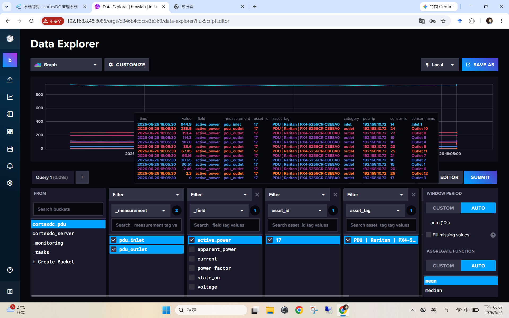
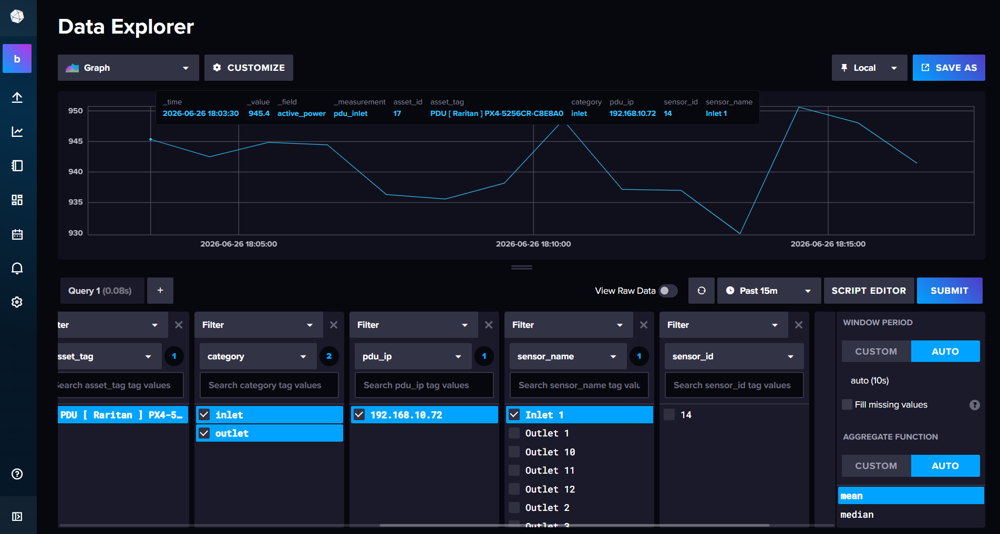

# Understanding PDU Data in InfluxDB

## 1. Access InfluxDB

Before using InfluxDB, make sure you have permission to access the system.

InfluxDB URL:

```text
http://192.168.8.48:8086/
```

> Note: This URL can only be used when the user has proper access permission and is connected to the correct internal network environment.

---

## 2. Current Query Conditions

The following example shows how to query PDU power data in InfluxDB.



### Bucket

```text
cortexdc_pdu
```

### Measurement

```text
✓ pdu_inlet
✓ pdu_outlet
```

### Field

```text
✓ active_power
```

This query means:

> Retrieve the **active power** of both the **PDU Inlet** and **all PDU Outlets**.

Therefore, InfluxDB returns multiple sensor values, including:

```text
Inlet 1
Outlet 1
Outlet 2
Outlet 3
...
Outlet 12
```

Each of these sensors is an independent measurement point.

---

## 3. Why Are There Many Values at the Same Timestamp?

For example, at the same timestamp:

```text
2026-06-26 18:05:30
```

InfluxDB is actually showing the power consumption of different PDU sensors:

| Time | Sensor | Active Power (W) |
|------|---------|-----------------:|
|18:05:30|Inlet 1|944.9|
|18:05:30|Outlet 10|239.5|
|18:05:30|Outlet 8|191.4|
|18:05:30|Outlet 5|114.3|
|18:05:30|Outlet 4|107.8|
|18:05:30|Outlet 9|88.6|
|18:05:30|Outlet 11|67.9|
|18:05:30|Outlet 7|66.2|
|18:05:30|Outlet 2|30.7|
|18:05:30|Outlet 1|30.5|
|18:05:30|Outlet 6|2.46|
|18:05:30|Outlet 12|2.30|
|18:05:30|Outlet 3|0|

It is **not** that one device has many different power values.

Instead:

> At the same timestamp, each PDU Outlet reports its own power consumption.

In other words, every Outlet is an independent power sensor.


---

## 4. Which Value Represents the RU Power?

If the goal is to read the power consumption of the RU (Radio Unit), the most important question is:

> Which PDU Outlet is connected to the RU?

For example:

```text
RU
│
└── PDU Outlet 10
```

Then:

```text
Outlet 10 = RU Power Consumption
```

If instead the RU is connected to Outlet 5:

```text
RU
│
└── PDU Outlet 5
```

Then:

```text
Outlet 5 = 114.3 W
```

This value represents the power consumption of the RU at that timestamp.

Therefore:

> The RU power is not the Inlet power.  
> The RU power is the `active_power` of the Outlet where the RU is connected.

---

## 5. Recommended Way to View RU Power

Instead of displaying all Outlets at the same time, add one more filter:

```text
sensor_name
```

Then select only the Outlet connected to the RU, for example:

```text
Outlet 10
```

After filtering by `sensor_name`, the graph will show only one time series.

This makes it easier to observe the power variation of the RU.



---

# PDU Inlet and Outlet Power Explanation

## 6. Why Is the Inlet Power Higher Than Each Outlet?

When querying `active_power` from PDU data, the Inlet value is usually much higher than a single Outlet value.

Example:

| Sensor | Active Power (W) |
|---------|-----------------:|
| Inlet 1 | 944.9 |
| Outlet 10 | 239.5 |
| Outlet 8 | 191.4 |
| Outlet 5 | 114.3 |
| Outlet 4 | 107.8 |
| Outlet 9 | 88.6 |
| Outlet 11 | 67.9 |
| Outlet 7 | 66.2 |
| Outlet 2 | 30.7 |
| Outlet 1 | 30.5 |
| Outlet 6 | 2.46 |
| Outlet 12 | 2.30 |
| Outlet 3 | 0 |

This is because the Inlet represents the total input power of the PDU.

---

## 7. PDU Structure

A PDU (Power Distribution Unit) can be understood as a smart power strip.

```text
          Utility Power
               │
               ▼
         PDU Inlet
      (Total Input Power)
               │
      ┌────────────────┐
      │      PDU       │
      └────────────────┘
       │   │   │   │
       ▼   ▼   ▼   ▼
   Outlet1 ... Outlet12
```

Where:

- **Inlet**: The total input power received by the PDU from utility power or UPS.
- **Outlet**: The output power distributed to each device, such as Server, RU, Switch, or other equipment.

---

## 8. Relationship Between Inlet and Outlet

In theory:

```text
P_Inlet ≈ Sum of all P_Outlet
```

Or in mathematical form:

```text
P_Inlet ≈ P_Outlet1 + P_Outlet2 + ... + P_OutletN
```

That means:

> Inlet power is approximately equal to the sum of all Outlet power.

---

## 9. Example Calculation

The sum of all Outlet active power is:

```text
239.5
+191.4
+114.3
+107.8
+88.6
+67.9
+66.2
+30.7
+30.5
+2.46
+2.30
≈ 941.7 W
```

The Inlet active power is:

```text
Inlet 1 = 944.9 W
```

The difference is:

```text
944.9 W - 941.7 W ≈ 3.2 W
```

This small difference may come from:

- The power consumption of the PDU itself
- Measurement resolution
- Sensor update time differences
- Rounding errors

Therefore, this result is reasonable.

---

## 10. Summary

- InfluxDB URL: `http://192.168.8.48:8086/`
- Access permission is required before using InfluxDB.
- Bucket: `cortexdc_pdu`
- Measurement: `pdu_inlet` and `pdu_outlet`
- Field: `active_power`
- Each Outlet is an independent power sensor.
- The same timestamp contains multiple values because multiple sensors report simultaneously.
- The Inlet represents the total input power of the PDU.
- The Outlet represents the power of each connected device.
- The Inlet power is approximately equal to the sum of all Outlet power.
- The RU power equals the `active_power` of the Outlet connected to the RU.
- Filtering by `sensor_name` allows users to monitor a single Outlet more clearly.
