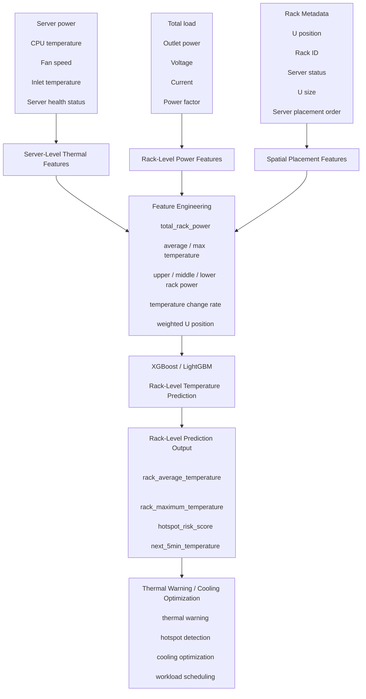

# 
0526~0528 Study Notes - Rack-Level Thermal Prediction Framework

---
### Table of Contents

- [1. Research Objective](#1-research-objective)
- [2. Motivation](#2-motivation)
- [3. Proposed Rack-Level Framework](#3-proposed-rack-level-framework)
- [4. Data Input Layer](#4-data-input-layer)
  - [4.1 Redfish Data](#41-redfish-data)
  - [4.2 PDU Data](#42-pdu-data)
  - [4.3 Rack Metadata](#43-rack-metadata)
- [5. Feature Engineering Layer](#5-feature-engineering-layer)
  - [5.1 Rack-Level Features](#51-rack-level-features)
  - [5.2 Spatial Features](#52-spatial-features)
  - [5.3 Thermal Features](#53-thermal-features)
- [6. Prediction Layer: XGBoost / LightGBM](#6-prediction-layer-xgboost--lightgbm)
  - [6.1 Model Input](#61-model-input)
  - [6.2 Model Output](#62-model-output)
- [7. Rack-Level Prediction Output](#7-rack-level-prediction-output)
  - [7.1 Example Outputs](#71-example-outputs)
---
# 1. Research Objective

The goal of this research is to develop a rack-level thermal prediction framework for data centers using:

- Redfish server monitoring data
- PDU power monitoring data
- Rack spatial metadata

The framework aims to predict:

- Rack average temperature
- Rack hotspot temperature
- Future thermal behavior

for cooling optimization and thermal-aware management.

---

# 2. Motivation

Modern data centers consume large amounts of power, and most electrical power is eventually converted into heat.

Traditional cooling systems often:

- react too slowly
- lack rack-level visibility
- cannot identify thermal hotspots early

Therefore, thermal prediction becomes important for:

- cooling optimization
- energy reduction
- thermal risk prevention
- workload scheduling

---

# 3. Proposed Rack-Level Framework

---
# 4.  Data Input Layer
## 4.1 Redfish Data
Input:
- Server current power
- Server average power
- CPU average temperature
- Air intake temperature
- Fan speed
- Server health status
- Power state
Purpose:
描述單台 server 的發熱狀態
---
## 4.2 PDU Data
Input:
- Rack total load
- Outlet power
- Voltage
- Current
- Power factor
- Energy consumption

Purpose:
描述整個 rack 的總耗電與總熱源

---
## 4.3 Rack Metadata

Input:
- Rack ID
- Server name
- U position
- U size
- Server online/offline status
- Server placement order

Purpose:
描述 server 在 rack 中的空間位置

---
# 5. Feature Engineering Layer

The raw monitoring data is transformed into rack-level thermal features.

## 5.1 Rack-Level Features

- `total_rack_power`
- `average_server_power`
- `maximum_server_power`
- `number_of_active_servers`

## 5.2 Spatial Features

- `upper_rack_power`
- `middle_rack_power`
- `lower_rack_power`
- `weighted_U_position`

## 5.3 Thermal Features

- `average_CPU_temperature`
- `maximum_CPU_temperature`
- `average_intake_temperature`
- `temperature_change_rate`

---

# 6. Prediction Layer: XGBoost / LightGBM

## 6.1 Model Input

### Power Features

- PDU total load
- Server power
- Outlet power

### Thermal Features

- CPU temperature
- Intake temperature
- Fan speed

### Spatial Features

- U position
- Rack ID
- Server distribution

## 6.2 Model Output

- `rack_average_temperature`
- `rack_maximum_temperature`
- `hotspot_risk_score`
- `next_5min_temperature`

---

# 7. Rack-Level Prediction Output

The prediction layer estimates the thermal condition of the entire rack.

## 7.1 Example Outputs

| Output | Description |
|---|---|
| Rack Avg Temp | Average rack temperature |
| Rack Max Temp | Highest rack temperature |
| Hotspot Risk | Potential overheating area |
| Future Temp | Future rack thermal trend |
