# Paper Survey
# Table of Contents

## 1. CPU / Server Power and Cooling Management Papers

### 1.1 Leakage-Aware Cooling Management for Improving Server Energy Efficiency (2015)

### 1.2 Optimal Performance-Aware Cooling on Enterprise Servers (2019)

### 1.3 An Artificial Neural Network Approach to Power Consumption Model Construction for Servers in Cloud Data Centers (2020)

---

## 2. Thermal Map Reconstruction Papers

### 2.1 Neural Network-Based Reconstruction of Steady-State Temperature Systems with Unknown Material Composition (2024)

### 2.2 A Deep Learning Method Based on Partition Modeling for Reconstructing Temperature Field (2022)

### 2.3 Continuous Field Reconstruction from Sparse Observations with Implicit Neural Networks (2024)

# Paper Review: Leakage-Aware Cooling Management for Improving Server Energy Efficiency. (2015)
## Reference:
M. Zapater,et al,"Leakage-Aware Cooling Management for Improving Server Energy Efficiency," IEEE Transactions on Parallel and Distributed Systems, vol. 26, no. 10, pp. 2764-2777, Oct. 1, 2015.

<div align="justify">

| Item              | Description                                                                                                    |
| ----------------- | -------------------------------------------------------------------------------------------------------------- |
| **Paper**         | *Leakage-Aware Cooling Management for Improving Server Energy Efficiency*                                      |                                                                                                           |
| **Main Focus**    | Leakage-aware cooling management for improving server energy efficiency                                        |
| **Main Method**   | Empirical power and temperature modeling with proactive fan speed control                                      |
| **Target System** | Enterprise server and data center cooling environment                                                          |
| **DOI**           | 10.1109/TPDS.2014.2361519                                                                                      |

</div>

---

### 1. Application Domain

<div align="justify">

This paper focuses on **server-level cooling management and energy optimization** in data centers. The main goal is to reduce server energy consumption by considering the interaction among computational power, temperature, leakage power, fan power, and workload allocation.

Instead of treating cooling control as a simple temperature regulation problem, this paper argues that cooling decisions should consider both:

* **Fan power**, which increases when the fan speed becomes higher
* **CPU leakage power**, which increases when the chip temperature becomes higher

Therefore, the best cooling condition is not necessarily the lowest fan speed or the lowest temperature. The goal is to find the fan speed that minimizes the total energy cost caused by both leakage power and fan power.

</div>

---

### 2. Challenge

<div align="justify">

The main challenge addressed in this paper is the trade-off between **cooling power** and **leakage power**.

If the fan speed is too high, the server temperature decreases, but the fan consumes more power. If the fan speed is too low, fan power decreases, but CPU temperature increases, which causes higher leakage power. Therefore, cooling control must find an optimal balance between fan power and leakage power.

Another challenge is that different workloads create different power and temperature behaviors. A CPU-intensive workload and a memory-intensive workload may require different optimal fan speeds. This means that a fixed fan speed policy cannot always provide the best energy efficiency.

Workload allocation also creates another challenge. If workloads are clustered on a small number of cores or sockets, some CPUs may become hotter than others. If workloads are distributed across more cores, the thermal profile may become more balanced, but more active cores may also increase power consumption. Therefore, fan control should be robust to different workload allocation policies.

Finally, the paper points out that simple metrics such as CPU utilization or IPC are not sufficient to estimate dynamic CPU power accurately. The same utilization level can correspond to different CPU power values depending on the workload characteristics.

</div>

---

### 3. Assumption

<div align="justify">

This paper makes several important assumptions for modeling and control.

First, the authors assume that the temperature-dependent leakage power of the server is mainly caused by the CPUs. Other components such as memory, disk, and network devices also consume power, but their temperature-dependent leakage contribution is less significant in this study.

Second, memory power is assumed to be mainly related to the memory access rate rather than temperature. Therefore, memory dynamic power can be modeled using the number of read/write memory accesses per second.

Third, CPU steady-state temperature is assumed to be predictable from CPU dynamic power and fan speed. Under a fixed fan speed, a higher CPU dynamic power generally leads to a higher steady-state CPU temperature.

Fourth, the authors assume that temperature changes more slowly than power changes. Since thermal time constants are in the order of minutes, the fan speed does not need to change every second. This helps avoid unnecessary fan speed oscillation and improves fan reliability.

</div>

---

### 4. Proposed Solution

<div align="justify">

The paper proposes a **leakage-aware proactive fan control policy**. The purpose of this policy is to dynamically choose the fan speed that minimizes the sum of CPU leakage power and fan power.

The optimization target can be expressed as:

```text
Minimize: Leakage Power + Fan Power
```

The proposed solution includes three main modeling steps and one control step.

#### 4.1 Server Power Model

The total server power is divided into three parts:
```math
P_{\text{server}} = P_{\text{static}} + P_{\text{dynamic}} + P_{\text{fan}}
```

| Term        | Meaning                                                                    |
| ----------- | -------------------------------------------------------------------------- |
|`P_static`  | Static power, including idle power and temperature-dependent leakage power |
| `P_dynamic` | Dynamic power caused by workload execution                                 |
| `P_fan`     | Cooling power consumed by server fans                                      |

The dynamic power is further divided into:

```math
P_{\text{dynamic}} = P_{\text{CPU,dyn}} + P_{\text{mem,dyn}} + P_{\text{other,dyn}}
```
This decomposition allows the system to separately analyze CPU power, memory power, other component power, and fan power.

#### 4.2 CPU Leakage Model

The CPU power is modeled as:

```math
P_{\text{CPU}} = P_{\text{CPU,idle}} + P_{\text{CPU,leakT}} + P_{\text{CPU,dyn}}
```

| Term          | Meaning                                        |
| ------------- | ---------------------------------------------- |
| `P_CPU,idle`  | CPU idle power                                 |
| `P_CPU,leakT` | Temperature-dependent CPU leakage power        |
| `P_CPU,dyn`   | Dynamic CPU power caused by workload execution |

Since leakage power increases with temperature, the authors use CPU temperature to estimate temperature-dependent leakage power.

#### 4.3 CPU Temperature Model

The paper also builds a CPU temperature model to estimate the steady-state CPU temperature under different fan speeds. The model predicts the temperature that a workload may reach based on CPU dynamic power and fan speed.

This is important because the fan controller needs to know what the temperature and leakage power would be if a different fan speed were selected.

#### 4.4 Proactive Fan Control Policy

The proactive fan control policy works as follows:

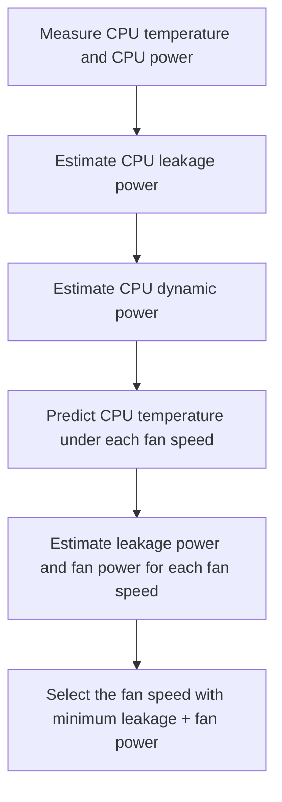

The policy does not wait until a thermal emergency occurs. Instead, it predicts the effect of each possible fan speed and proactively selects the best one.

</div>

---

#### 5. Evaluation Environment

<div align="justify">

The evaluation is mainly based on **real experiments** using a commercial enterprise server.

| Component                   | Description                            |
| --------------------------- | -------------------------------------- |
| **Processor**               | Two SPARC T3 processors                |
| **Hardware Threads**        | 256 hardware threads                   |
| **Memory**                  | 32 × 8 GB DIMMs                        |
| **Storage**                 | Two hard drives                        |
| **Fan Speed Range**         | 1800 RPM to 4200 RPM                   |
| **Sensor Polling Interval** | 1 second                               |
| **Fan Control Method**      | External Agilent E3644A power supplies |

The collected telemetry data includes:

* CPU temperature
* Memory temperature
* Per-CPU voltage
* Per-CPU current
* Total server power
* Fan speed
* Workload-related hardware counters

For model training, the paper uses two synthetic workloads:

| Workload    | Purpose                                               |
| ----------- | ----------------------------------------------------- |
| **LoadGen** | Generates controllable CPU utilization and CPU stress |
| **RandMem** | Generates controllable memory access behavior         |

For validation and policy evaluation, the paper uses real benchmark suites:

| Benchmark              | Purpose                                            |
| ---------------------- | -------------------------------------------------- |
| **SPEC Power_ssj2008** | Evaluates server power and performance             |
| **SPEC CPU2006**       | Tests CPU-intensive and memory-intensive workloads |
| **PARSEC**             | Tests multi-threaded workload behavior             |

The paper also includes a larger-scale trace-based evaluation using power traces from a real data center cluster at the Madrid Supercomputing and Visualization Center. This part evaluates how the proposed policy may perform in a broader data center environment.

</div>

---

#### 6. Key Result

<div align="justify">

The experimental results show that the proposed proactive fan control policy can reduce energy consumption without performance loss.

The main results are summarized below:

| Result                             | Description                                                                       |
| ---------------------------------- | --------------------------------------------------------------------------------- |
| **Leakage + fan energy reduction** | Up to 6% compared with existing policies                                          |
| **CPU energy reduction**           | More than 9% compared with the default server control policy                      |
| **Workload allocation benefit**    | Up to 15% energy saving when using the best energy-delay product allocation       |
| **Data center trace result**       | Around 2.5% CPU power reduction for the whole cluster at 27°C ambient temperature |
| **Performance impact**             | No performance penalty reported                                                   |

The results show that considering leakage power is important for energy-efficient cooling control. The proposed policy performs better than fixed fan speed, TAPO, bang-bang control, and LUT-based fan control because it directly estimates the leakage and fan power trade-off.

</div>

---

#### 7. Relevance to Proposed Framework

<div align="justify">

This paper is highly relevant to the **optimization layer** of the proposed data center thermal prediction and power optimization framework.

The proposed framework can be connected to this paper as follows:

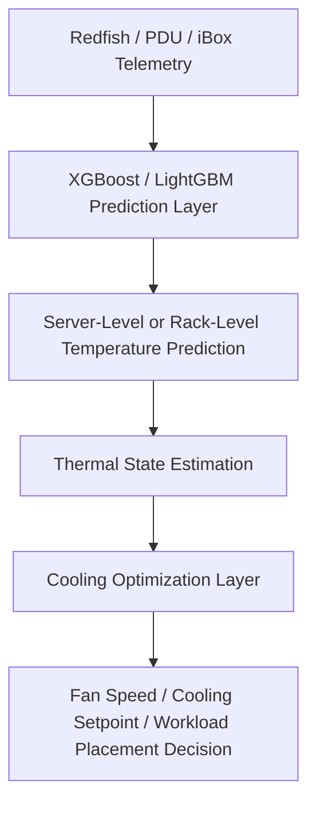

This paper supports several important ideas in the proposed framework:

| Proposed Framework Part            | Support from This Paper                                                                                   |
| ---------------------------------- | --------------------------------------------------------------------------------------------------------- |
| **Server telemetry features**      | CPU temperature, server power, fan speed, and workload counters are useful for thermal and power modeling |
| **Power-temperature relationship** | Server energy depends on the interaction among power, temperature, leakage, and cooling                   |
| **Cooling optimization**           | Fan speed can be selected dynamically to reduce energy consumption                                        |
| **Workload-aware management**      | Different workload allocation policies change temperature and leakage behavior                            |
| **Energy-aware objective**         | Optimization should consider not only hotspot prevention but also leakage power and fan power             |

This paper can be used to support the idea that thermal prediction should not stop at temperature estimation. The prediction result should be connected to cooling control and energy optimization decisions.

</div>

---

#### 8. Limitation

<div align="justify">

Although this paper provides a strong server-level cooling optimization method, it still has several limitations with respect to the proposed rack-level thermal prediction framework.

First, the paper focuses mainly on **single-server-level fan control**. It does not directly reconstruct rack-level or room-level thermal maps.

Second, the paper does not use XGBoost, LightGBM, U-Net, or other deep learning models. Instead, it uses empirical power and temperature models.

Third, the output of the system is an optimized fan speed, not a spatial thermal heatmap. Therefore, it does not directly provide hotspot location or room-level thermal distribution.

Fourth, the method assumes that fan speed can be directly controlled. In a real data center, direct fan control may not always be available depending on server management permissions and hardware constraints.

Fifth, the paper does not consider rack metadata such as U position, rack placement, PDU outlet-level power, or spatial server arrangement. These factors are important for rack-level thermal prediction.

</div>

---

#### 9. Takeaway

<div align="justify">

Zapater et al. supports the **cooling optimization layer** of the proposed framework.

The key idea of this paper is that cooling management should not only minimize temperature. Instead, it should balance:

* Fan power
* CPU leakage power
* Workload behavior
* Workload allocation
* Server performance

For the proposed framework, this paper can be used as evidence that temperature prediction should be connected to energy-aware control actions. It is especially useful for supporting fan speed control, cooling setpoint adjustment, and workload-aware thermal optimization.

</div>

> [!NOTE]
> **Takeaway**
>
> This paper supports the idea that prediction alone is not enough. A complete thermal management framework should connect temperature prediction with leakage-aware cooling control and energy optimization.
---
# Paper Review: Optimal Performance-Aware Cooling on Enterprise Servers (2019)

## Reference:

C. S. Chan, A. S. Akyürek, B. Aksanli, and T. Šimunic Rosing, "Optimal Performance-Aware Cooling on Enterprise Servers," IEEE Transactions on Computer-Aided Design of Integrated Circuits and Systems, vol. 38, no. 9, pp. 1689-1702, Sept. 2019.

<div align="justify">

| Item              | Description                                                               |
| ----------------- | ------------------------------------------------------------------------- |
| **Paper**         | *Optimal Performance-Aware Cooling on Enterprise Servers*                 |
| **Main Focus**    | Performance-aware cooling management for enterprise servers               |
| **Main Method**   | Convex optimization with power, thermal, fan, and disk-performance models |
| **Target System** | Enterprise server running data-intensive database workloads               |
| **DOI**           | 10.1109/TCAD.2018.2855122                                                 |

</div>

---

### 1. Application Domain

<div align="justify">

This paper focuses on **server-level cooling control and performance-aware energy optimization** in enterprise data centers.

Traditional server cooling control mainly tries to keep the server temperature below a safe threshold. However, this paper points out that cooling fans do not only affect temperature and power consumption. In data-intensive servers, high fan speeds can also generate mechanical vibration, and this vibration may reduce hard disk drive performance.

Therefore, the cooling problem should not only consider:

* CPU temperature
* Fan power
* Server energy consumption

but should also consider:

* Disk I/O performance
* Workload execution time
* Fan-induced vibration
* Application-level performance degradation

The main goal of this paper is to find a fan speed control policy that maintains thermal safety while reducing energy consumption and avoiding unnecessary performance loss.

</div>

---

### 2. Challenge

<div align="justify">

The main challenge is the trade-off among **cooling, energy, and performance**.

If the fan speed is too low, the server may become too hot and violate the thermal constraint. If the fan speed is too high, the server becomes cooler, but the fan consumes more power and may generate vibration that slows down hard disk performance.

This is especially important for data-intensive workloads because many database applications depend heavily on disk I/O. Even if the CPU temperature is safe, high fan speed may still reduce application performance through disk throughput degradation.

Another challenge is that different workloads have different resource behaviors. Some workload states are CPU-intensive, while others are I/O-intensive. Therefore, a fixed fan speed or a simple PID controller may not always be energy-efficient or performance-aware.

The paper also points out that existing thermal management policies usually focus on processor temperature and power, but they often ignore the relationship between cooling fan speed and disk performance.

</div>

---

### 3. Assumption

<div align="justify">

This paper makes several assumptions for modeling and optimization.

First, the workload behavior can be represented as a sequence of hardware states. Each state contains CPU utilization and I/O bandwidth information.

Second, fan speed affects disk throughput because higher fan speed can produce stronger mechanical vibration. This effect is especially significant for commodity SATA hard disks.

Third, the server power, temperature, and fan-disk interaction can be modeled using analytical models. These models are needed so that the fan speed optimization problem can be solved formally.

Fourth, the fan speed can be controlled by the server management system. In the paper, fan speed is controlled through IPMI-based hardware management.

Finally, the workload is assumed to be predictable enough so that an optimal fan control policy can be computed based on known workload states.

</div>

---

### 4. Proposed Solution

<div align="justify">

The paper proposes a **performance-aware optimal fan control policy**. The policy considers not only temperature and power, but also the effect of fan speed on disk performance.

The proposed solution includes four main parts:

1. Measure the relationship between fan speed, vibration, and disk throughput.
2. Build models for workload, power, temperature, and disk delay.
3. Formulate the fan control problem as a convex optimization problem.
4. Select fan speeds that minimize total energy while satisfying thermal constraints.

</div>

#### 4.1 Workload Representation

<div align="justify">

The workload is represented using CPU utilization and I/O bandwidth.

The resource utilization vector is:

```text
<c0, c1, ..., cN-1, io>
```

| Term | Meaning                             |
| ---- | ----------------------------------- |
| `ci` | Utilization of CPU core i           |
| `io` | Percentage of maximum I/O bandwidth |

The paper uses k-means clustering to group similar utilization patterns into hardware states. Each database query is then represented as a chain of workload states.

For example:

```text
Database Query
      ↓
CPU / I/O utilization trace
      ↓
K-means clustering
      ↓
Workload state sequence
      ↓
Fan control decision per state
```

</div>

#### 4.2 Power Model

<div align="justify">

The total server power is modeled as the sum of dynamic power, static power, and fan power.

```math
\varepsilon_{\text{power}}(w,T,f)
=
\varepsilon_{\text{dynamic}}(w)
+
\varepsilon_{\text{static}}(T)
+
\varepsilon_{\text{fan}}(f)
```

| Term           | Meaning                                        |
| -------------- | ---------------------------------------------- |
| `w`            | Current workload state                         |
| `T`            | Server or chip temperature                     |
| `f`            | Fan speed                                      |
| `ε_dynamic(w)` | Dynamic power caused by workload execution     |
| `ε_static(T)`  | Static or leakage power related to temperature |
| `ε_fan(f)`     | Power consumed by the cooling fan              |

The fan power is modeled as a cubic function:

```math
\varepsilon_{\text{fan}}(f) = r_f f^3
```

This means that fan power increases rapidly when fan speed becomes higher.

</div>

#### 4.3 Thermal Model

<div align="justify">

The paper uses a simplified thermal model to estimate the temperature at the next interval.

```math
T_{i+1}
=
T_i e^{-\frac{t}{\tau}}
+
T_{ss}
\left(
1 - e^{-\frac{t}{\tau}}
\right)
```

| Term      | Meaning                                                       |
| --------- | ------------------------------------------------------------- |
| `T_i`     | Temperature at the current interval                           |
| `T_{i+1}` | Temperature at the next interval                              |
| `t`       | Duration of the workload interval                             |
| `τ`       | Thermal time constant                                         |
| `T_ss`    | Steady-state temperature under a given workload and fan speed |

This model allows the controller to predict how the server temperature will change under different fan speed choices.

</div>

#### 4.4 Cooling and Disk Performance Model

<div align="justify">

The paper models the relationship between fan speed and disk throughput using a sigmoid-like function.

```math
\text{ThroughputFactor}(f)
=
\frac{\alpha}{\beta + e^{\gamma f}}
```

| Term                  | Meaning                                  |
| --------------------- | ---------------------------------------- |
| `f`                   | Fan speed                                |
| `α, β, γ`             | Parameters fitted from measurement data  |
| `ThroughputFactor(f)` | Disk throughput factor under fan speed f |

When fan speed becomes higher, disk throughput may decrease because fan vibration becomes stronger.

The execution time of a workload state is modeled as:

```math
\varepsilon_{\text{time}}(w,f)
=
c(w)
\cdot
\frac{\beta + e^{\gamma f}}{\alpha}
```

| Term          | Meaning                                       |
| ------------- | --------------------------------------------- |
| `c(w)`        | Ideal execution time of workload state w      |
| `f`           | Fan speed                                     |
| `ε_time(w,f)` | Actual execution time after fan-induced delay |

This model connects cooling fan speed to application performance.

</div>

#### 4.5 Optimal Fan Control

<div align="justify">

The optimization goal is to minimize the total execution cost while keeping the temperature below the thermal limit.

```math
\min_f C_N(f)
```

Subject to:

```math
T_i \leq T_{\text{limit}}, \quad \forall i \in [0,N]
```

| Term      | Meaning                                      |
| --------- | -------------------------------------------- |
| `C_N(f)`  | Total cost of executing N workload intervals |
| `T_i`     | Temperature at interval i                    |
| `T_limit` | Maximum allowed temperature                  |
| `f`       | Fan speed decision                           |

When the cost is energy, the total energy is:

```math
E_N
=
\sum_{i=1}^{N}
\varepsilon_{\text{power}}(w_i,T_{i-1},f_i)
\cdot
\varepsilon_{\text{time}}(w_i,f_i)
```

The controller chooses fan speeds that reduce energy consumption while avoiding thermal violations and disk-performance degradation.

</div>

#### 4.6 Overall Flow

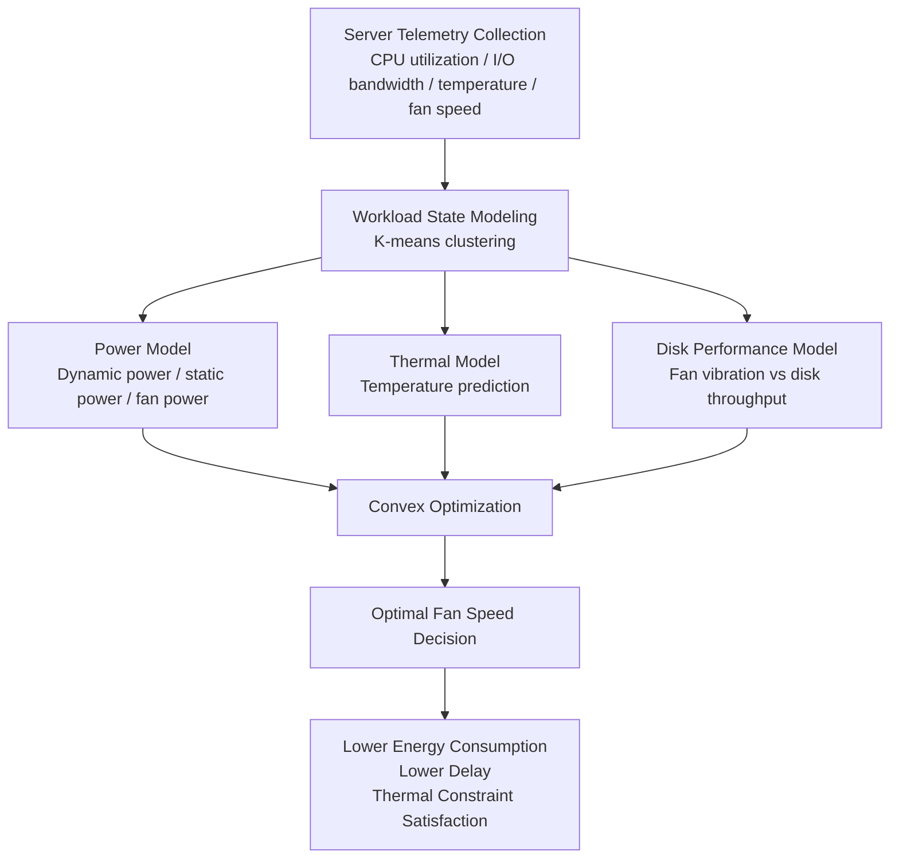

---

### 5. Evaluation Environment

<div align="justify">

The evaluation is based on a real enterprise server and simulation using measured system data.

| Component         | Description                                   |
| ----------------- | --------------------------------------------- |
| **Server Type**   | Enterprise rack server                        |
| **Processor**     | 8-core SPARC server processor                 |
| **Memory**        | Multiple DIMM modules                         |
| **Storage**       | SATA, SAS, and SSD drives                     |
| **Fan Control**   | Fan speed controlled through IPMI             |
| **Workload**      | TPC-H database benchmark and SPEC CPU2006     |
| **Thermal Limit** | 85°C                                          |
| **Modeling Tool** | MATLAB-based simulation using measured traces |

The paper compares the proposed optimal controller with several existing cooling policies:

| Policy           | Description                                           |
| ---------------- | ----------------------------------------------------- |
| **PID**          | Traditional feedback-based temperature controller     |
| **PID-1**        | PID controller with a lower temperature setpoint      |
| **Adaptive PID** | PID controller with fan-region-dependent tuning       |
| **JETC**         | Joint energy, thermal, and cooling management policy  |
| **Optimal**      | Proposed performance-aware convex optimization policy |

</div>

---

### 6. Key Result

<div align="justify">

The paper shows that fan speed can significantly affect disk performance. In the fan sweep experiment, commodity SATA disks suffered large throughput degradation at high fan speeds.

The main results are summarized below:

| Result                       | Description                                                                             |
| ---------------------------- | --------------------------------------------------------------------------------------- |
| **Fan-disk interaction**     | High fan speed can reduce SATA disk throughput because of fan-induced vibration         |
| **Maximum disk degradation** | Commodity drives may experience up to 65% to 88% performance loss                       |
| **Energy saving vs PID**     | Proposed policy reduces energy consumption by about 65% compared with basic PID control |
| **Energy saving vs JETC**    | Proposed policy reduces energy consumption by about 19% compared with JETC              |
| **Execution speed**          | Proposed policy is about 2× faster than heuristic PID-based policies                    |
| **Thermal safety**           | The optimal policy satisfies thermal constraints without emergency throttling           |
| **Model robustness**         | Even with modeling noise, the optimal policy still outperforms most baseline policies   |

The key result is that cooling control should not blindly increase fan speed. A higher fan speed may reduce temperature, but it can also increase fan power and slow down disk-heavy workloads.

</div>

---

### 7. Relevance to Proposed Framework

<div align="justify">

This paper is highly relevant to the **cooling decision and optimization layer** of the proposed rack-level thermal prediction framework.

The proposed framework can be connected to this paper as follows:

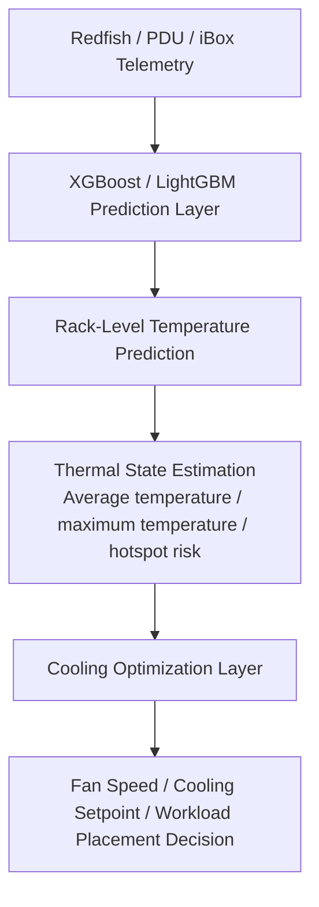

This paper supports several important ideas in the proposed framework:

| Proposed Framework Part            | Support from This Paper                                                                         |
| ---------------------------------- | ----------------------------------------------------------------------------------------------- |
| **Server telemetry features**      | CPU utilization, temperature, fan speed, power, and I/O behavior are useful for thermal control |
| **Power-temperature relationship** | Server power, temperature, and cooling are strongly connected                                   |
| **Cooling decision layer**         | Fan speed should be selected based on energy, temperature, and performance                      |
| **Performance-aware control**      | Cooling decisions may affect application performance, especially disk-heavy workloads           |
| **Optimization objective**         | The final decision should minimize energy while satisfying thermal constraints                  |
| **Hotspot prevention**             | Thermal constraints can be included directly in the optimization problem                        |

For the proposed rack-level system, this paper can support the idea that the predicted thermal state should be connected to an action layer. In other words, after XGBoost or LightGBM predicts rack temperature or hotspot risk, the system should use that result to make cooling or workload-placement decisions.

</div>

---

### 8. Limitation

<div align="justify">

Although this paper is useful for cooling optimization, it has several limitations with respect to the proposed rack-level thermal prediction framework.

First, the paper focuses on **single-server-level cooling control**, not rack-level thermal map reconstruction.

Second, the paper does not use XGBoost, LightGBM, U-Net, or deep learning models. It mainly uses analytical modeling and convex optimization.

Third, the system output is an optimized fan speed, not a rack-level or room-level thermal heatmap.

Fourth, the method assumes that fan speed can be directly controlled. In real data centers, direct fan control may require special permission or hardware access.

Fifth, the paper focuses heavily on disk-performance degradation caused by fan vibration. This is useful for data-intensive workloads, but may be less important for SSD-based systems or CPU-only workloads.

Sixth, the paper does not consider rack metadata such as U position, rack ID, server placement, PDU outlet-level power, or spatial airflow interaction between servers.

</div>

---

### 9. Takeaway

<div align="justify">

Chan et al. supports the **cooling optimization layer** of the proposed framework.

The key idea of this paper is that cooling management should not only keep temperature low. A complete cooling policy should balance:

* Server temperature
* Fan power
* CPU power
* Disk I/O performance
* Workload execution time
* Thermal constraint satisfaction

For the proposed framework, this paper is useful because it shows that thermal prediction should be connected to performance-aware cooling decisions.

It is especially suitable for supporting the final stage of the framework:

```text
Rack-Level Temperature Prediction
        ↓
Thermal State / Hotspot Risk
        ↓
Cooling Decision
        ↓
Energy and Performance Optimization
```

</div>

> [!NOTE]
> **Takeaway**
>
> This paper supports the idea that cooling control should be performance-aware. In the proposed framework, XGBoost or LightGBM can first predict the rack-level thermal state, and the prediction result can then be used for cooling optimization, fan speed control, or workload placement decisions.
---

# Paper Review: An Artificial Neural Network Approach to Power Consumption Model Construction for Servers in Cloud Data Centers. (2020)

## Reference:
W. Lin, et al "An Artificial Neural Network Approach to Power Consumption Model Construction for Servers in Cloud Data Centers," IEEE Transactions on Sustainable Computing, vol. 5, no. 3, pp. 329-340, July-Sept. 2020.

<div align="justify">

| Item              | Description                                                                                                       |
| ----------------- | ----------------------------------------------------------------------------------------------------------------- |
| **Paper**         | *An Artificial Neural Network Approach to Power Consumption Model Construction for Servers in Cloud Data Centers* |
| **Main Focus**    | Server power consumption prediction in cloud data centers                                                         |
| **Main Method**   | ANN-based power modeling using BP Neural Network, Elman Neural Network, and LSTM                                  |
| **Target System** | Cloud servers and data center energy management                                                                   |
| **DOI**           | 10.1109/TSUSC.2019.2910129                                                                                        |

</div>

---

### 1. Application Domain

<div align="justify">

This paper focuses on **server power consumption prediction** in cloud data centers. The main goal is to estimate the real-time power consumption of cloud servers based on system performance data.

Power prediction is important because it can support:

* Energy-aware scheduling
* Server energy management
* Power monitoring without expensive hardware meters
* Data center energy-saving decisions

Instead of using only simple mathematical formulas or CPU utilization-based models, this paper proposes an **Artificial Neural Network (ANN)** approach to model the nonlinear relationship between server performance counters and power consumption.

</div>

---

### 2. Challenge

<div align="justify">

The main challenge addressed in this paper is that server power consumption is difficult to model accurately under different workload conditions.

Traditional power models often use fixed mathematical formulas, such as linear regression between CPU utilization and power consumption. However, this approach has several problems.

- First, server workloads are complex and changeable. A CPU-intensive workload, memory-intensive workload, I/O-intensive workload, and mixed workload may produce different power behavior.

- Second, CPU utilization alone is not enough to describe the complete server power state. Memory usage, disk activity, I/O operations, and time-dependent system behavior can also affect power consumption.

- Third, server power consumption is not always a simple linear relationship. Different components interact with each other, so nonlinear models may be needed.

- Fourth, the power consumption at the current time may be affected by previous system states. Therefore, the model should consider the time continuity of server performance data.

</div>

---

### 3. Assumption

<div align="justify">

This paper makes several important assumptions for server power consumption modeling.

First, the authors assume that server power consumption can be estimated from system performance counters collected from the operating system.

Second, the paper assumes that different types of workloads have different power characteristics. Therefore, the model should be trained and tested under multiple workload types.

Third, the authors assume that ANN-based models can learn nonlinear relationships between input performance features and output power consumption better than traditional regression models.

Fourth, the paper assumes that time-series information is useful for power prediction. This is why the authors compare a time-window BP neural network, Elman neural network, and LSTM neural network.

</div>

---

### 4. Proposed Solution

<div align="justify">

The paper proposes an **ANN-based server power consumption modeling framework**. The model uses system performance counters as input and predicts the real-time server power consumption as output.

The general workflow is:

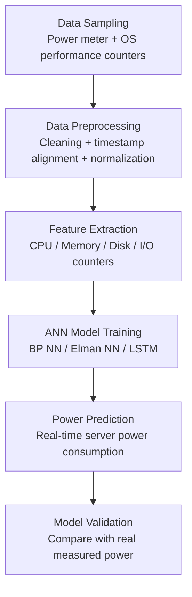

#### 4.1 Input Features

The model uses **16 performance counter features** from the operating system.

| Feature Type       | Example Features                                                 |
| ------------------ | ---------------------------------------------------------------- |
| **CPU-related**    | Processor Time, User Time, Privileged Time, Processor Utility    |
| **Memory-related** | Commit Bytes in Use, Available MBytes, Page/sec, Page Faults/sec |
| **Disk-related**   | Disk Time, Current Disk Queue Length, Disk Bytes/sec             |
| **I/O-related**    | Disk Transfer/sec, IO Data Bytes/sec, IO Data Operation/sec      |

These features are used because they can describe the system state more completely than CPU utilization alone.

#### 4.2 Output

The model output is:

```text
Real-time server power consumption
```

In simple form:

```math
\hat{P}_{server}(t) = f(\text{CPU features}, \text{Memory features}, \text{Disk features}, \text{I/O features})
```

| Term           | Meaning                                               |
| -------------- | ----------------------------------------------------- |
| `P_server(t)`  | Server power consumption at time t                    |
| `f( )`         | ANN-based prediction function                         |
| Input features | System performance counters collected from the server |

#### 4.3 ANN Models

The paper compares three ANN-based power prediction models.

| Model        | Description                            |
| ------------ | -------------------------------------- |
| **TW_BP_PM** | Time-window BP neural network          |
| **ENN_PM**   | Elman neural network-based power model |
| **MLSTM_PM** | Multi-layer LSTM-based power model     |

#### 4.4 TW_BP_PM

TW_BP_PM uses a time window and BP neural network to predict server power consumption.

The idea is that current power consumption may depend not only on the current system state, but also on previous system states.

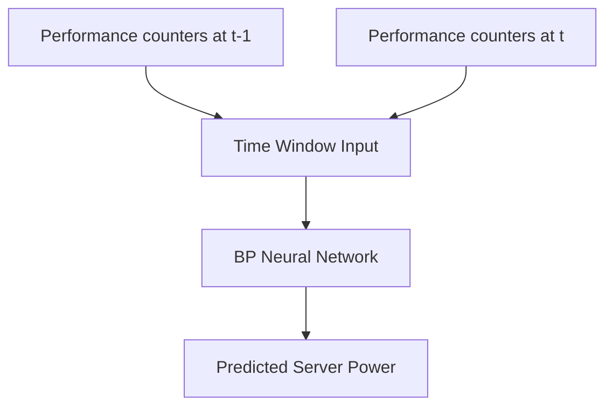

#### 4.5 ENN_PM

ENN_PM uses an Elman neural network, which is a type of recurrent neural network.

The hidden state from the previous time step is used as part of the current prediction. This helps the model learn time-dependent system behavior.

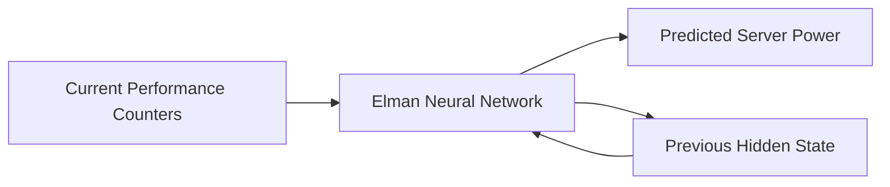

#### 4.6 MLSTM_PM

MLSTM_PM uses a multi-layer LSTM model. LSTM is designed to learn longer time dependencies and reduce the vanishing gradient problem in traditional recurrent neural networks.

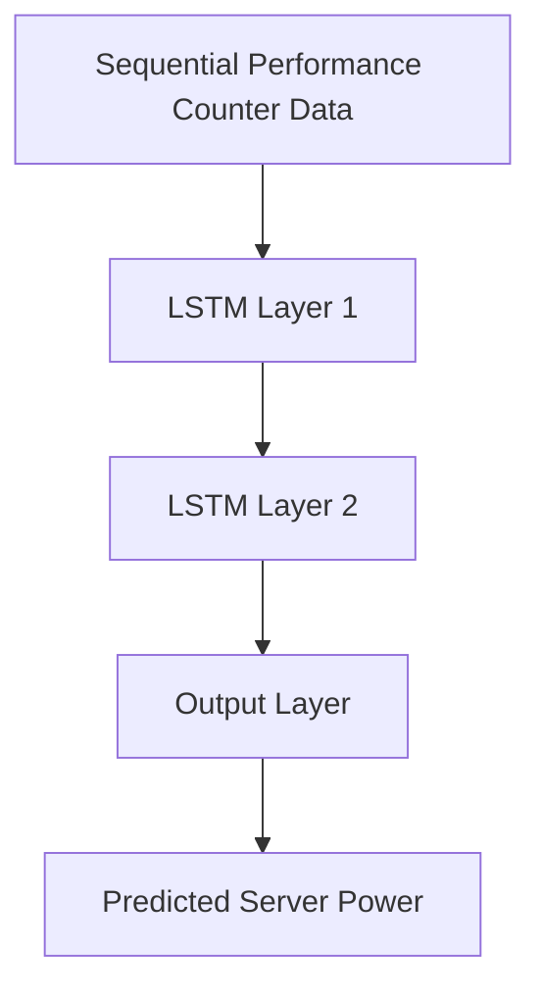

</div>

---

### 5. Evaluation Environment

<div align="justify">

The evaluation is based on real experiments using a workstation server and measured power data.

| Component             | Description                              |
| --------------------- | ---------------------------------------- |
| **Machine**           | Dell Precision 3520 workstation          |
| **Processor**         | Intel Core i7-7700H                      |
| **Memory**            | DDR4 8 GB                                |
| **Disk**              | 1 TB, 7200 rpm                           |
| **Power Measurement** | External power meter                     |
| **OS**                | Microsoft Windows 10                     |
| **Framework**         | TensorFlow                               |
| **Data Split**        | 75% training, 5% validation, 20% testing |

The paper evaluates four workload types:

| Workload Type        | Benchmark / Tool   |
| -------------------- | ------------------ |
| **CPU-intensive**    | Primeload, Grab-Ex |
| **Memory-intensive** | RandMem            |
| **I/O-intensive**    | IOzone             |
| **Mixed workload**   | PCMark7            |

The collected dataset includes:

| Workload Type        | Number of Records |
| -------------------- | ----------------- |
| **CPU-intensive**    | 2247              |
| **Memory-intensive** | 1907              |
| **I/O-intensive**    | 2847              |
| **Mixed workload**   | 4053              |

</div>

---

### 6. Key Result

<div align="justify">

The experimental results show that ANN-based models can predict real-time server power consumption more accurately than traditional models such as Multiple Linear Regression and Support Vector Regression.

#### 6.1 TW_BP_PM Result

| Workload Type    | Mean Relative Error | Mean Absolute Error |
| ---------------- | ------------------- | ------------------- |
| CPU-intensive    | 6.7%                | 1.17 W              |
| Memory-intensive | 7.1%                | 1.21 W              |
| I/O-intensive    | 4.1%                | 0.59 W              |
| Mixed            | 8.6%                | 1.60 W              |

#### 6.2 ENN_PM Result

| Workload Type    | Mean Relative Error | Mean Absolute Error |
| ---------------- | ------------------- | ------------------- |
| CPU-intensive    | 7.3%                | 1.48 W              |
| Memory-intensive | 13.6%               | 1.92 W              |
| I/O-intensive    | 6.2%                | 0.84 W              |
| Mixed            | 11.9%               | 2.49 W              |

#### 6.3 MLSTM_PM Result

| Workload Type    | Mean Relative Error | Mean Absolute Error |
| ---------------- | ------------------- | ------------------- |
| CPU-intensive    | 5.8%                | 1.15 W              |
| Memory-intensive | 7.2%                | 1.14 W              |
| I/O-intensive    | 10.0%               | 1.40 W              |
| Mixed            | 9.3%                | 1.70 W              |

Overall, **TW_BP_PM and MLSTM_PM** show better prediction accuracy. TW_BP_PM has good overall accuracy, while MLSTM_PM is stronger at learning time-series behavior. ENN_PM has lower computational overhead, but its prediction error is larger under memory-intensive and mixed workloads.

</div>

---

### 7. Relevance to Proposed Framework

<div align="justify">

This paper is highly relevant to the **server power prediction layer** of the proposed rack-level thermal prediction framework.

The proposed framework can be connected to this paper as follows:

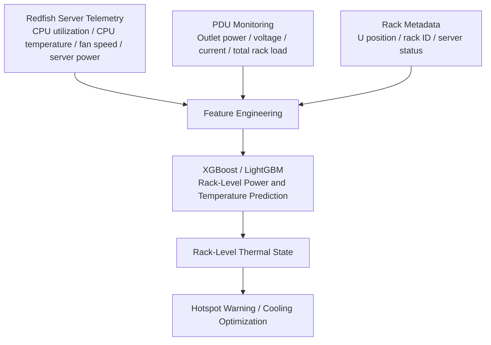

This paper supports several important ideas in the proposed framework:

| Proposed Framework Part   | Support from This Paper                                                                       |
| ------------------------- | --------------------------------------------------------------------------------------------- |
| **Server power modeling** | Server power can be predicted from system performance counters                                |
| **Feature engineering**   | CPU, memory, disk, and I/O features are useful for power prediction                           |
| **Workload awareness**    | Different workload types produce different power behavior                                     |
| **Time-series modeling**  | Previous system states may affect current power consumption                                   |
| **ML-based prediction**   | ANN models can outperform traditional regression models for nonlinear server power prediction |

For the proposed rack-level framework, this paper can support the idea that **server telemetry data can be used to estimate power behavior**, and this estimated power behavior can become an important input feature for rack-level temperature prediction.

</div>

---

### 8. Limitation

<div align="justify">

Although this paper provides a useful ANN-based server power prediction method, it still has several limitations with respect to the proposed rack-level thermal prediction framework.

First, the paper focuses mainly on **server-level power consumption prediction**. It does not directly predict rack-level temperature or reconstruct a rack-level thermal map.

Second, the paper uses CPU, memory, disk, and I/O performance counters, but it does not include rack metadata such as U position, rack placement, server location, or rack layout.

Third, the model predicts power consumption, not temperature. Therefore, an additional thermal prediction model is still needed if the goal is rack-level thermal prediction.

Fourth, the experiments are conducted on one workstation server. The result may need further validation in a real multi-server rack or data center environment.

Fifth, the proposed ANN models are useful, but they are not tree-based models such as XGBoost or LightGBM. Therefore, for our framework, the paper mainly supports the concept of telemetry-based power modeling rather than directly supporting the exact model choice.

</div>

---

### 9. Takeaway

<div align="justify">

Lin et al. supports the **server power prediction and feature engineering layer** of the proposed framework.

The key idea of this paper is that server power consumption can be predicted using system performance data, and machine learning models can capture nonlinear relationships better than simple regression models.

For the proposed framework, this paper is useful because it shows that:

* Server telemetry can be used as input features
* CPU, memory, disk, and I/O behavior are related to server power
* Different workloads cause different power consumption patterns
* Time-series information can improve power prediction
* Power prediction can support energy-aware data center management

This paper can be used as supporting literature for building a prediction pipeline from server monitoring data to rack-level power and thermal estimation.

</div>

> [!NOTE]
> **Takeaway**
>
> This paper supports the idea that server telemetry and workload-related features can be used to predict power consumption. In our framework, this predicted or measured server power can become an important feature for rack-level temperature prediction and hotspot detection.
---

---
# Paper Review: Neural Network-Based Reconstruction of Steady-State Temperature Systems with Unknown Material Composition (2024)

## Reference

Sabathiel, Silvester, et al. "Neural network-based reconstruction of steady-state temperature systems with unknown material composition." *Scientific Reports*, 2024.

| Item              | Description                                                                                                 |
| ----------------- | ----------------------------------------------------------------------------------------------------------- |
| **Paper**         | *Neural Network-Based Reconstruction of Steady-State Temperature Systems with Unknown Material Composition* |
| **Main Focus**    | Reconstructing complete steady-state temperature fields from sparse temperature observations                |
| **Main Method**   | Physics-informed fully convolutional autoencoder with a spatial propagator module                           |
| **Target System** | 2D thermal systems and PCB-based thermal measurement systems                                                |
| **DOI**           | 10.1038/s41598-024-73380-1                                                                                  |

### 1. Research Problem

This paper aims to reconstruct a complete steady-state temperature field from only partial temperature observations.

The key problem is that the material composition, heat source distribution, and boundary conditions are unknown.

In our case, this can be related to reconstructing a full rack-level thermal map from limited Server / iBox / PDU data.

---

### 2. Motivation and Challenges

Thermal field reconstruction is difficult because temperature sensors are usually limited, and complete temperature measurements are hard to obtain.

The challenge becomes harder when the internal material distribution, heat source positions, heat source values, and boundary conditions are unknown.

This is similar to data center environments, where sensors are limited and the internal thermal behavior of racks is difficult to observe directly.

---

### 3. Assumptions

The paper assumes that the system can be approximated as a 2D steady-state thermal system.

The model only receives sparse temperature observations as input.

The model does not require additional information about:

* Material distribution
* Heat source position
* Heat source value
* Boundary conditions

This setting is called blind virtual sensing.

---

### 4. Proposed Solution

The paper proposes a neural-network-based reconstruction method.

The architecture includes:

* Spatial propagator module
* Fully convolutional autoencoder
* U-Net-like encoder-decoder structure
* Physics-informed loss function

The spatial propagator first spreads the known temperature information into the missing regions.

Then, the autoencoder reconstructs the complete temperature field.

The physics-informed loss helps the model produce smoother and more physically reasonable temperature fields.

---

### 5. Input and Output

**Input:**

* Sparse temperature observations
* Mask information showing known and unknown temperature positions

The paper tests three sampling methods:

* Scattered sampling
* Ring sampling
* Grid-edge sampling

For our framework, the input can be:

* Server temperature
* Server power
* iBox inlet temperature
* PDU power data
* Rack position information

**Output:**

* Reconstructed complete 2D temperature field
* Full thermal map

---

### 6. Training Data and Data Source

The training data are generated using FEM simulation.

Each system is converted into a 50 × 50 temperature image.

This means each temperature map contains:

```text
50 × 50 = 2500 temperature points
```

The original dataset contains 775 thermal systems.

After data augmentation using rotation, the dataset becomes 3100 systems.

The paper also uses real PCB thermal measurement data for experimental validation.

---

### 7. Evaluation Environment

The paper evaluates the method using both simulation and experiment.

**Simulation environment:**

* 2D steady-state thermal systems
* FEM-generated temperature fields
* Random material distribution
* Random heat source distribution
* Random boundary conditions

**Experimental environment:**

* PCB board
* SMD resistors as heat sources
* Thermal camera measurement
* Real temperature field reconstruction

This shows that the model is not only tested on simulated data but also validated with real thermal measurement data.

---

### 8. Evaluation Metrics

The main evaluation metric is average relative error.

The paper compares the reconstructed temperature field with the ground truth temperature field.

The result shows that the reconstruction error is below about 1.15% in most cases.

For the most challenging grid-edge sampling case, the model can still reconstruct the full temperature field with about 1.1% relative average error.

---

### 9. Experimental Results

The proposed method performs well under sparse sampling conditions.

Scattered sampling gives the best reconstruction result because the sensors are distributed across the whole field.

Ring sampling and grid-edge sampling are more difficult because the model only observes boundary information.

However, even with grid-edge sampling and only about 3.12% sampling ratio, the model can still reconstruct the full temperature field with low error.

The neural network also outperforms Kriging, especially in estimating maximum temperature and handling sparse observations.

---

### 10. Limitations

The paper has several limitations:

* The main model is trained for 2D systems, while real thermal systems are often 3D.
* The model may fail to detect very localized hotspots.
* If heat does not propagate to the sensor region, boundary sensors may not provide enough information.
* The model depends on whether the training data can represent the real target system.
* The real PCB experiment still has 3D effects, convection, radiation, and thickness-direction heat dissipation that are not fully modeled.

---

### 11. Summary of the Problem

This paper addresses the problem of reconstructing a complete temperature field from sparse temperature measurements when the material composition, heat source distribution, and boundary conditions are unknown.

The main idea is to use a physics-informed neural network to learn the possible thermal distribution from limited sensor data.

---

### 12. Relation to Our Framework

This paper can support the thermal map reconstruction part of our framework.

We can refer to the following ideas:

* Sparse temperature sensing to full thermal map reconstruction
* Using a U-Net-like model for temperature field reconstruction
* Using physics-informed loss to improve physical consistency
* Handling unknown material and heat source distributions
* Validating reconstruction with both simulation and real thermal data

Possible connection:

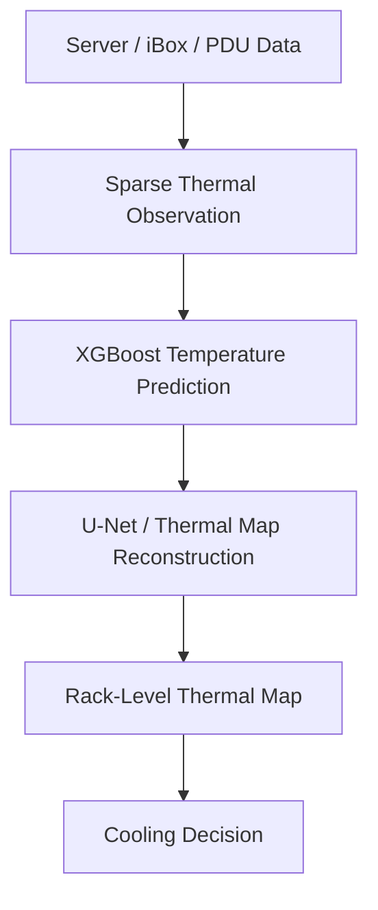


# Paper Review : A Deep Learning Method Based on Partition Modeling for Reconstructing Temperature Field(2022)

## Reference: 
Xingwen Peng,et al."A deep learning method based on partition modeling for reconstructing temperature field.",International Journal of Thermal Sciences,Volume 182,2022.


| Item              | Description                                                                               |
| ----------------- | ----------------------------------------------------------------------------------------- |
| **Paper**         | *A Deep Learning Method Based on Partition Modeling for Reconstructing Temperature Field* |
| **Main Focus**    | Temperature field reconstruction from limited temperature observations                    |
| **Main Method**   | Partition modeling framework with Adaptive UNet and shallow MLP                           |
| **Target System** | Electronic equipment thermal field reconstruction                                         |

---

### 1. Research Problem

This paper aims to reconstruct the complete temperature field of electronic equipment from limited temperature observation points.

In our case, this is related to reconstructing a full rack-level thermal map from limited Server / iBox / PDU data.

---

### 2. Motivation and Challenges

Thermal field reconstruction is difficult because only limited temperature sensors can be deployed in real systems.

Also, temperature fields may have complex spatial distributions, especially near heat sources or heatsinks where large temperature gradients appear.

This is similar to data center environments, where sensors are limited and the thermal behavior may vary depending on rack layout, server placement, and power distribution.

---

### 3. Reconstruction Method

The paper proposes a partition modeling framework consisting of:

* Adaptive UNet
* Shallow MLP

The Adaptive UNet is used to reconstruct the overall temperature field.

The shallow MLP is used to improve the reconstruction accuracy in large-gradient regions, especially near the heatsink.

---

### 4. Input and Output

**Input:**

* Sparse temperature observation points
* Observation point locations

For our framework, the input can be:

* Server temperature / power
* iBox inlet temperature
* PDU power data
* Rack position information

**Output:**

* Reconstructed full temperature field
* Full thermal map of the system

---

### 5. Training Data and Data Source

The paper uses finite element simulation data generated by FEM.

The temperature field is generated from different heat source layouts and power intensities.

This means the method is mainly validated using simulation data, not real hardware measurement data.

---

### 6. Evaluation Metrics

The paper uses several metrics to evaluate reconstruction performance:

* MAE: Mean Absolute Error
* CMAE: Component-constrained Mean Absolute Error
* MaxAE: Maximum Absolute Error
* MT-AE: Absolute Error of Maximum Temperature

These metrics evaluate both the overall reconstruction error and the hotspot-related error.

---

### 7. Experimental Results

The proposed method can accurately reconstruct the temperature field from limited observation points.

The results show that Adaptive UNet can reconstruct the overall thermal map, while the additional MLP improves the accuracy in large-gradient regions.

The paper also shows that only 16 observation points can still achieve good reconstruction performance.

---

### 8. Limitations

The method is mainly tested using simulation data.

It focuses on steady-state temperature field reconstruction, not real-time or time-series thermal prediction.

Also, the target system is electronic equipment, not directly a data center or rack-level cooling environment.

---

### 9. Relation to Our Framework

This paper can support the thermal map reconstruction part of our framework.

We can refer to the following ideas:

* Sparse sensor input to full thermal map reconstruction
* CNN / U-Net-based thermal reconstruction
* Partition modeling for large-gradient region refinement
* Hybrid architecture using UNet + MLP
* Sensor placement strategy
* Hotspot estimation
* Potential connection to Digital Twin thermal monitoring

Possible connection:


This paper is highly related to the “U-Net / Thermal Map Reconstruction” layer in our framework. It supports the idea that limited sensor data can be used to reconstruct a complete thermal distribution, which is useful for rack-level thermal monitoring and future cooling optimization.


# Paper Review: Continuous Field Reconstruction from Sparse Observations with Implicit Neural Networks(2024)
## Reference: Luo, Xihaier, et al. "Continuous field reconstruction from sparse observations with implicit neural networks."International Conference on Learning Representations. Vol. 2024.

| Item              | Description |
| ----------------- | ----------- |
| **Paper**         | *Continuous Field Reconstruction from Sparse Observations with Implicit Neural Networks* |
| **Main Focus**    | Continuous physical field reconstruction from sparse observations |
| **Main Method**   | Implicit Neural Representation (INR) with MMGN and latent code-based reconstruction |
| **Target System** | Scientific physical fields, including climate simulation and satellite-based sea surface temperature fields |
| **DOI**           | Not specified in the paper |
### 1. Research Problem
This paper aims to reconstruct a complete continuous physical field from sparse observations.

In our case, this can be related to reconstructing a full thermal map from limited Server / iBox / PDU data.

---

### 2. Motivation and Challenges
Thermal field reconstruction is difficult because sensor data are usually sparse, sensor locations may be irregular, and the thermal field can have complex spatial variations.

This is similar to data center environments, where sensors are limited and rack layouts are different.

---

### 3. Reconstruction Method
The paper proposes an INR-based method called MMGN.

Instead of reconstructing a fixed image only, the model learns a continuous field representation using spatial coordinates and latent information.

---

### 4. Input and Output
**Input:**
- Sparse observation values
- Spatial coordinates

For our framework, the input can be:
- Server temperature / power
- iBox inlet temperature
- PDU power data
- Rack position information

**Output:**
- Reconstructed continuous thermal map

---

### 5. Training Data and Data Source
The paper uses both simulation-based climate data and satellite-based sea surface temperature data.

This shows that the method can work with simulated data and real-world observation data.

---

### 6. Evaluation Metrics
The paper mainly uses MSE to evaluate reconstruction error.

It also discusses PSNR and SSIM for evaluating reconstruction quality and structural similarity.

---

### 7. Experimental Results
The proposed MMGN method outperforms several INR baseline models, especially when the observation data are very sparse.

This supports the idea that sparse sensor data can still be used to reconstruct a reliable full field.

---

### 8. Limitations
The method is not directly designed for data center thermal management.

Also, the paper mainly focuses on reconstruction, not cooling control or long-term thermal forecasting.

---

### 9. Relation to Our Framework
This paper can support the thermal map reconstruction part of our framework.

We can refer to the following ideas:

- Sparse observation to full thermal map reconstruction
- Using latent code to represent the overall thermal state
- Using spatial coordinates to reconstruct a continuous thermal field
- Handling different sensor numbers and sensor locations
- Extending Server / iBox / PDU data into a full rack-level thermal map

Possible connection:
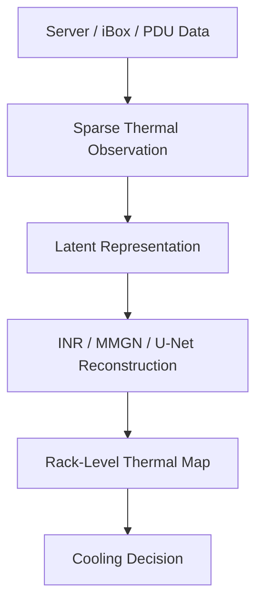
