# 0730 log

1. 訓練模型
2. 知道如何運用end to end 來造成cpu溫度變化

## 訓練模型
## Experiment 3
預測5/10/15分鐘後的溫度，比較預測時間長短的影響
- 輸入:取樣5分鐘的過去資料(cpu temp、fan rpm、inlet temp、server power)
- 輸出:5/10/15分鐘後的cpu 溫度
- 評估方式: MAE、RMSE、MAX Error、推論時間
- 資料：8 台 server 的 CortexDC 資料
- 處理：多 sensor 合併成代表值，非 CPU 溫度排除
- 切分：70% train、15% validation、15% test
# 結果比較表

| 預測時間 | Horizon step | Samples | Train | Validation | Test | MAE | RMSE | Max Error | Inference time |
|---|---:|---:|---:|---:|---:|---:|---:|---:|---:|
| 5 分鐘後 | 1 | 2260 | 1582 | 339 | 339 | 0.482°C | 0.674°C | 2.651°C | 0.000033 sec |
| 10 分鐘後 | 2 | 2252 | 1576 | 338 | 338 | 0.624°C | 0.903°C | 3.977°C | 0.000031 sec |
| 15 分鐘後 | 3 | 2244 | 1570 | 337 | 337 | 0.744°C | 1.094°C | 4.370°C | 0.000039 sec |
# Experiment 3 結論
結果說明預測時間越長 誤差越大，預測時間的長短會影響結果的精準度。

---
## Experiment 4
| 輸入組合 | MAE | RMSE | Max Error | 結果說明 |
|---|---:|---:|---:|---|
| CPU only | 0.532°C | 0.727°C | 2.675°C | 表現最好 |
| CPU + Power | 0.571°C | 0.794°C | 3.919°C | Power 有些資訊，但未優於 CPU only |
| CPU + Inlet | 0.606°C | 0.871°C | 3.383°C | Inlet 有幫助有限，可能受缺值或平穩影響 |
| All features | 0.637°C | 0.933°C | 4.253°C | 全部特徵不一定最好 |
| CPU + Fan | 0.678°C | 0.980°C | 4.274°C | 表現最差，fan 可能變化小或有延遲 |

# Experiment 4 結論
本實驗固定 5 分鐘取樣資料與 10 分鐘預測目標，比較不同 input feature 組合對 XGBoost 模型的影響。
結果顯示，`F0_cpu_only` 表現最佳，MAE 為 0.532°C、RMSE 為 0.727°C。加入 `server_power`、`fan_rpm` 或 `inlet_temp` 後，模型誤差並未降低。
因此，在目前資料條件下，CPU temperature 的歷史序列是最有效的預測特徵，而其他特徵尚未展現明顯貢獻。
此結果也說明目前資料可能過於平穩，後續應延長資料收集時間或加入不同負載情境，以進一步驗證多特徵模型的效益。

---
## Experiment 5

# Persistence Baseline 結果表

| 預測時間 | Horizon step | Samples | Train | Validation | Test | MAE | RMSE | Max Error |
|---|---:|---:|---:|---:|---:|---:|---:|---:|
| 5 分鐘後 | 1 | 2260 | 1582 | 339 | 339 | 0.367°C | 0.588°C | 2.400°C |
| 10 分鐘後 | 2 | 2252 | 1576 | 338 | 338 | 0.442°C | 0.657°C | 2.333°C |
| 15 分鐘後 | 3 | 2244 | 1570 | 337 | 337 | 0.483°C | 0.714°C | 2.667°C |

# Persistence Baseline 與 XGBoost 比較表

| 預測時間 | Persistence MAE | XGBoost MAE | Persistence RMSE | XGBoost RMSE | Persistence Max Error | XGBoost Max Error | 較佳方法 |
|---|---:|---:|---:|---:|---:|---:|---|
| 5 分鐘後 | 0.367°C | 0.482°C | 0.588°C | 0.674°C | 2.400°C | 2.651°C | Persistence |
| 10 分鐘後 | 0.442°C | 0.624°C | 0.657°C | 0.903°C | 2.333°C | 3.977°C | Persistence |
| 15 分鐘後 | 0.483°C | 0.744°C | 0.714°C | 1.094°C | 2.667°C | 4.370°C | Persistence |

# Experiment 5結論
Persistence baseline 在 5、10、15 分鐘後的 CPU temperature prediction 中皆優於 XGBoost。
此結果表示目前 24 小時資料中的 CPU temperature 變化相對平穩，因此直接使用目前溫度作為未來預測值即可得到良好結果。
後續若要展現 XGBoost 或其他機器學習模型的優勢，應收集更長時間資料，或加入不同負載情境，使溫度、功率與風扇轉速產生更明顯變化。

---
## Experiment 6

# 結果比較

| Lag set | 歷史時間範圍 | MAE | RMSE | Max Error | 結果 |
|---|---:|---:|---:|---:|---|
| L0_current_only | 目前 | 0.555°C | 0.810°C | 3.801°C | 最佳 |
| L1_5min | 前 5 分鐘 | 0.581°C | 0.830°C | 3.802°C | 稍差 |
| L2_10min | 前 10 分鐘 | 0.624°C | 0.903°C | 3.977°C | 誤差上升 |
| L3_15min | 前 15 分鐘 | 0.643°C | 0.932°C | 3.860°C | 誤差上升 |
| L4_30min | 前 30 分鐘 | 0.658°C | 0.953°C | 3.800°C | MAE 最高 |
| L5_60min | 前 60 分鐘 | 0.625°C | 0.906°C | 3.789°C | 未明顯改善 |

```mermaid
xychart-beta
    title "Lag Length Test Result"
    x-axis ["L0", "L1", "L2", "L3", "L4", "L5"]
    y-axis "Error (°C)" 0 --> 1.0
    bar "MAE" [0.555, 0.581, 0.624, 0.643, 0.658, 0.625]
    bar "RMSE" [0.810, 0.830, 0.903, 0.932, 0.953, 0.906]
```

# Persistence Baseline 比較

| 方法 | 設定 | 10 分鐘 MAE | 10 分鐘 RMSE |
|---|---|---:|---:|
| Persistence | `y_pred = cpu_temp(t)` | 0.442°C | 0.657°C |
| XGBoost L0 | 只用目前特徵 | 0.555°C | 0.810°C |
| XGBoost L1 | 目前 + 前 5 分鐘 | 0.581°C | 0.830°C |
| XGBoost L2 | 目前 + 前 5 / 10 分鐘 | 0.624°C | 0.903°C |
| XGBoost L3 | 目前～前 15 分鐘 | 0.643°C | 0.932°C |
| XGBoost L4 | 目前～前 30 分鐘 | 0.658°C | 0.953°C |
| XGBoost L5 | 目前～前 60 分鐘 | 0.625°C | 0.906°C |

```mermaid
xychart-beta
    title "10-minute CPU Temperature Prediction Comparison"
    x-axis ["Persistence", "XGBoost L0", "XGBoost L1", "XGBoost L2", "XGBoost L3", "XGBoost L4", "XGBoost L5"]
    y-axis "Error (°C)" 0 --> 1.0
    bar "MAE" [0.442, 0.555, 0.581, 0.624, 0.643, 0.658, 0.625]
    bar "RMSE" [0.657, 0.810, 0.830, 0.903, 0.932, 0.953, 0.906]
```

# 結果意義

| 觀察 | 說明 |
|---|---|
| L0_current_only 表現最好 | 只使用目前狀態已能提供主要預測資訊 |
| Lag 越長未必越好 | 更長歷史資料沒有改善預測結果 |
| L2 與前一版結果一致 | `[0,1,2]` 的 MAE 為 0.624°C，與 10 分鐘 XGBoost 結果相同 |
| Persistence 仍優於 XGBoost | 代表目前資料短期變化非常平穩 |
| 資料可能缺乏明顯熱變化 | 模型難以從更長歷史資料中學到額外趨勢 |

# 結論
本實驗測試不同 lag length 對 XGBoost CPU temperature prediction 的影響。結果顯示，增加歷史時間窗並未改善模型表現，反而使 MAE 與 RMSE 上升。
其中，只使用目前時間點特徵的 `L0_current_only` 表現最佳，MAE 為 0.555°C；而使用前 30 分鐘歷史資料的 `L4_30min` 表現最差，MAE 為 0.658°C。
此結果說明，目前 24 小時資料中的 CPU temperature 變化相對平穩，短期預測主要受目前溫度狀態影響，較長歷史資料並未提供明顯幫助。後續若要驗證 lag features 的效果，應收集更長時間資料，或加入不同負載情境，使 CPU temperature 呈現更明顯的變化。

## 如何應用end to end 控制負載
利用打入不同的troughput 100MG~900MG 的流量去改變cpu的使用率，經觀測發現在測試的過程中隨著流量的改變以及cpu 使用率的變化，cpu溫度明顯有升高變化。
因此可以藉此方式來改變溫度的變化。
但目前的限制是:
1. 目前只有一套end to end 系統且只使用在Lavoisier。所以現在測試階段，若要收集不同負載的溫度變化資料，只能收集一個伺服器的cpu 溫度，來訓練模型。
2. 目前cpu 使用率只能當下觀測，無法存取。要另外架設環境

