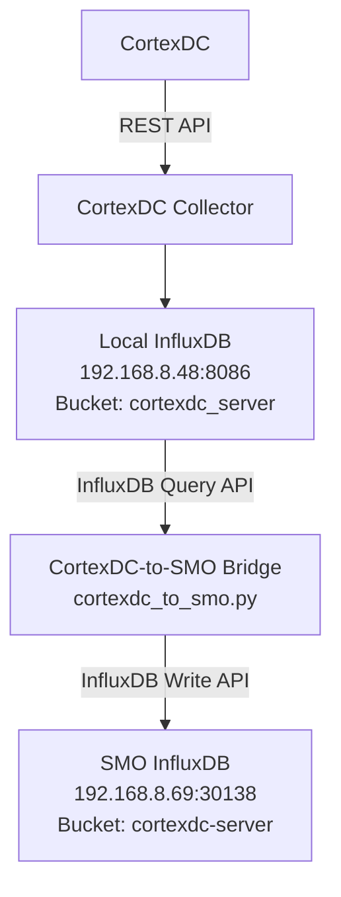

# 0819 

## short goal
1. 把SMO 中collector 跟Ravi 的collector 搞清楚
2. 解決VM不能連上CortexDC的問題

## 1. 數據的走向

- 原本架構中SMO裡的collector不應該放在裡面，對照現在的方法是cortexdc collector 蒐集cortexdc 的數據並存入local influxdb([192.168.8.](http://192.168.8.48:8086/))
- 再用Bridge把Local influxdb的數據送入SMO influxdb(198.168.8.69:30138)
- 
- 

- 為什麼不用o1ves??
  - 因為 CortexDC 的資料是透過 CortexDC REST API 擷取，而不是透過 O1/VES 介面取得，因此不需要經過 O1 VES 的資料處理流程，可以直接由 Local InfluxDB 將資料轉送至 SMO InfluxDB。

## cortexdc 跟 Bridge的差別
CortexDC Collector 透過 REST API 從 CortexDC 擷取監控資料並存入 Local InfluxDB；Bridge 則從 Local InfluxDB 查詢已收集的資料，再透過 InfluxDB API 同步至 SMO InfluxDB。
| 元件                     | 從哪裡拿資料         | 用什麼方式拿                          | 寫到哪裡           |
| ---------------------- | -------------- | ------------------------------- | -------------- |
| **CortexDC Collector** | CortexDC       | **CortexDC REST API**           | Local InfluxDB |
| **Bridge**             | Local InfluxDB | **InfluxDB Query API / Client** | SMO InfluxDB   |
| Bridge 寫入端             | —              | **InfluxDB Write API / Client** | SMO InfluxDB   |

## collector

## Bridge

---

## VM 無法連上cortexdc
- 因斷電導致VM、cortexdc PC 斷電，重啟後也無法連上
- 原因: 有 192.168.10.76 有 vlan3 的網域 導致無法連接至192.168.8.48
- 解決方法: 把vlan3移除，即可連上。 
